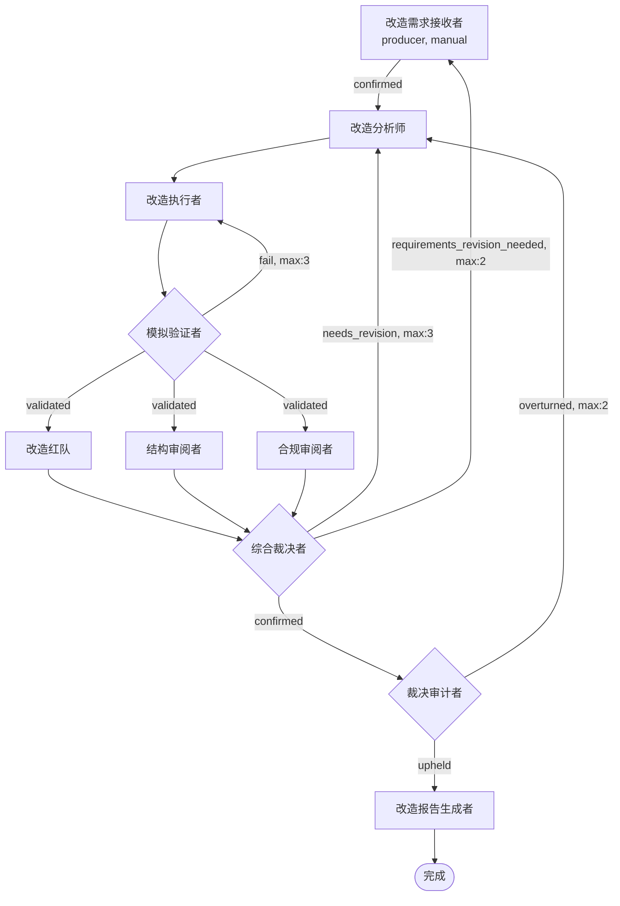

# APP 构建报告

## 一、构建概览

| 项目 | 内容 |
|------|------|
| **目标 APP 名称** | app-modifier（多角色 APP 改造器） |
| **构建时间** | 2026-07-13 |
| **迭代轮次** | 第 1 轮（首次构建） |
| **当前状态** | ✅ **completed**（构建完成） |

> app-modifier 是一个针对现有 APP 进行增量改造的多角色系统，经过分析→执行→验证→审阅→裁决→审计的完整质量闭环后，输出改造后的 APP 文件包。与 app-builder 互补：app-builder 从零构建，app-modifier 增量改造。

---

## 二、需求摘要

构建一个名为 **app-modifier（多角色 APP 改造器）** 的多角色 APP，能够针对现有 APP 进行增量修改——在已有 APP 基础上做安全、可控、可追溯的增量改造，而非从零重建。通过七维模拟验证 + 三路并行审阅 + 裁决审计复核，确保改造后的 APP 仍然结构正确、编排合规、向后兼容。

需求文档经历 3 个版本迭代（v1 初版 → v2 结构化 → v3 修复 2 major + 6 minor），最终通过需求红队六维度对抗分析 confirmed。

---

## 三、生成的架构总览

### 角色清单

| 序号 | 角色 | 类型 | confirm | 职责 |
|------|------|------|---------|------|
| R1 | 改造需求接收者 | 文档层·入口 | manual | 接收目标 APP 路径 + 改造要求，校验路径有效性，转化为结构化改造需求文档 |
| R2 | 改造分析师 | 文档层 | auto | 读取现有 APP 全部文件，产出结构化改造方案（改动清单 + 影响范围 + 风险评估） |
| R3 | 改造执行者 | 执行层 | auto | 按改造方案修改 app.yaml / skill.md / schema.json，重新编译目标 APP |
| R4 | 模拟验证者 | 执行层 | auto | 七维 dry-run 校验 + 向后兼容性检查 |
| R5 | 改造红队 | 治理层·对抗 | auto | 最恶劣条件下压力测试改造后 APP 的架构健壮性 |
| R6 | 结构审阅者 | 治理层·审阅 | auto | DAG 拓扑完整性、角色定义完备性、边引用一致性 |
| R7 | 合规审阅者 | 治理层·审阅 | auto | 唯一权威源、编译期确定性、物料分类、skill 无硬编码路径 |
| R8 | 综合裁决者 | 治理层·裁决 | auto | 合并三路审阅结果，做三路径裁决（confirmed / needs_revision / requirements_revision_needed） |
| R9 | 裁决审计者 | 治理层·审计 | auto | 对 R8 的 confirmed 裁决做全链路对抗复核（upheld / overturned） |
| R10 | 改造报告生成者 | 文档层·终点 | auto | 生成人类可读改造报告；兼任迭代超限失败报告产出者 |

### 流程拓扑（Mermaid 图）

**三层正交分层**：文档层（R1/R2/R10）只产文档不编码 · 执行层（R3/R4）只按方案操作 · 治理层（R5-R9）只审查不修改交付物

**四条 backward 边**（三层迭代安全阀）：
- 验证回退：R4 fail→R3（局部回退，默认 max:3）
- 改造迭代回路：R8 needs_revision→R2（max:3）+ R9 overturned→R2（max:2）= 合计 5 ≤ 5
- 全局迭代回路：R8 requirements_revision_needed→R1（max:2）

---

## 四、生成的文件清单

### 角色文件树（10 角色 × 2 文件 = 20 文件）

| 角色 | skill.md | schema.json |
|------|----------|-------------|
| 改造需求接收者 | ✅ | ✅ |
| 改造分析师 | ✅ | ✅ |
| 改造执行者 | ✅ | ✅ |
| 模拟验证者 | ✅ | ✅ |
| 改造红队 | ✅ | ✅ |
| 结构审阅者 | ✅ | ✅ |
| 合规审阅者 | ✅ | ✅ |
| 综合裁决者 | ✅ | ✅ |
| 裁决审计者 | ✅ | ✅ |
| 改造报告生成者 | ✅ | ✅ |

### 知识文档（6 份）

| 知识文档 | inject_to |
|----------|-----------|
| knowledge/编排范式.md | 改造分析师、改造执行者、结构审阅者、合规审阅者 |
| knowledge/七维模拟验证方法论.md | 模拟验证者、改造红队 |
| knowledge/改造影响分析方法论.md | 改造分析师 |
| knowledge/改造执行规范.md | 改造执行者 |
| knowledge/审阅标准手册.md | 改造红队、结构审阅者、合规审阅者 |
| knowledge/裁决与审计标准.md | 综合裁决者、裁决审计者 |

### 编排文件

| 文件 | 说明 |
|------|------|
| app.yaml | 编排权威源（273 行，含 8 段设计约定注释） |
| 00-需求描述.md | 结构化需求文档（JSON 格式，350 行，七要素齐全） |

---

## 五、验证结果摘要

### 模拟验证（七维 dry-run 校验）

| 维度 | 结果 |
|------|------|
| 维度一：DAG 可达性 | ✅ pass — 10 个角色全部可达，无死角色、无孤儿边 |
| 维度二：verdict 出边完备性 | ✅ pass — 所有声明的 verdict 在 edges 中均有对应出边 |
| 维度三：数据流完整性 | ✅ pass — 每个 input 有上游 output 来源，可选输入已标注 |
| 维度四：loop 收敛性与 max_executions | ✅ pass — 4 条 backward 边均有退出条件，QUA-1/2/3 全部满足 |
| 维度五：语义一致性 | ✅ pass — skill.md 与 edges 语义完全对齐，无硬编码路径 |
| 维度六：知识文档数据流 | ✅ pass — 6 份知识文档全部存在，inject_to 与 app.yaml 一致 |
| 维度七：skill 与 schema 格式一致性 | ✅ pass — 10/10 角色 verdict 三方完全一致（skill ↔ schema ↔ edges） |

**CF-2 修复确认**：R8 needs_revision→R2 max:3 + R9 overturned→R2 max:2 = 5 ≤ 5（QUA-1 ✓）

### 三路并行审阅

| 审阅者 | verdict | 检查项 | pass | fail |
|--------|---------|--------|------|------|
| 结构审阅者（R6） | confirmed | 20 | 20 | 0 |
| 合规审阅者（R7） | confirmed | 18 | 18 | 0 |
| 改造红队（R5） | confirmed | 6 维度 | 6 | 0 |

### 综合裁决与审计

| 裁决阶段 | verdict | 说明 |
|----------|---------|------|
| 综合裁决者（R8） | **confirmed** | 三路审阅全 confirmed，0 critical/major/minor，仅 1 个 info 观察项 |
| 裁决审计者（R9） | **confirmed**（upheld） | 四维审计全部 pass，未发现遗漏 blocking 问题，维持原判 |

### 缺陷统计

| 严重级别 | 数量 |
|----------|------|
| Critical | **0** |
| Major | **0** |
| Minor | **0**（阻塞） |
| Info（非阻塞观察项） | 4 |

---

## 六、TRACK 追踪

### TRACK 统计

| 类别 | 总数 | 已关闭 | 未关闭 |
|------|------|--------|--------|
| Critical | 1 | 1 | 0 |
| Major | 2 | 2 | 0 |
| Minor | 3 | 0 | 3（非阻塞） |
| Info | 1 | 0 | 1（非阻塞） |

**阻塞项：0** — 所有 critical/major 已修复关闭。

### 已关闭 TRACK 明细

| TRACK | 严重级别 | 标题 | 状态 |
|-------|----------|------|------|
| TRACK-001（AR-001） | major | R9 裁决审计者 verdict 语义与拓扑描述矛盾 | ✅ CLOSED — v3 八处统一重新定义 |
| TRACK-002（AR-002） | major | 全局迭代回路 R8→R1 在 DAG 拓扑中缺失 | ✅ CLOSED — v3 显式建模 + 五处交叉验证 |
| TRACK-003（CF-2） | critical | max_executions 配额矛盾（合计可达 10，违反 QUA-1） | ✅ CLOSED — 拆分 max:3+max:2=5，7 文件 17 处同步更新 |

### 未关闭观察项（非阻塞）

| TRACK | 严重级别 | 标题 | 影响 |
|-------|----------|------|------|
| TRACK-004（OBS-1） | info | 需求文档 §4.1/§4.3 max 标注为旧值 5 | 不影响运行时，app.yaml 为权威源 |
| TRACK-005（OBS-001） | minor | 改造迭代回路 max 预算语义歧义 | CF-2 修复后已消解（MITIGATED） |
| TRACK-006（OBS-002） | minor | R2/R3 未显式定义 verdict 值域 | 框架约定隐式 confirmed，无影响 |
| TRACK-007（OBS-003） | minor | R1 fail 路径未在拓扑显式建模 | producer manual confirm，用户直接重新提交 |

### 知识演进沉淀

1. **裁决审计语义模型**：审计者只复核放行决策（confirmed），不复核回退决策。upheld→放行，overturned→回退。
2. **三层迭代安全阀范式**：验证回退（局部）→ 改造迭代（中层）→ 全局迭代（需求层），逐级兜底。
3. **max_executions 全链路同步更新方法论**：app.yaml 为权威源，修改后须同步更新所有 skill.md 和 knowledge 文档中的引用。

---

## 七、下一步建议

**结论：APP 构建完成（completed）。**

所有阻塞 TRACK 已关闭，架构通过七维模拟验证 + 三路并行审阅 + 综合裁决 + 裁决审计的完整质量闭环。APP 可投入运行。

**后续迭代建议（非阻塞，按优先级排序）：**

1. **TRACK-004**（info）：在需求文档迭代中同步更新 §4.1/§4.3 的 max_executions 标注（5→3 / 5→2），消除人类阅读歧义。
2. **TRACK-006**（minor）：在 R2/R3 角色定义中显式注明 "线性角色，verdict 隐式 confirmed"，提升文档完备性。
3. **TRACK-007**（minor）：在 §4.1 拓扑中补充 R1 fail 注释（路径校验失败时流程不启动）。
4. **TRACK-005**（minor）：随 TRACK-004 一并消解（需求文档标注更新后语义歧义自然消除）。

> **无 SDK_SPEC 演进提案**。本轮构建所有缺陷均属于 APP 设计层面，不涉及框架级规范改进。
