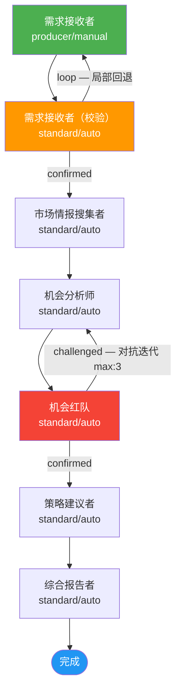

# APP 构建报告 — 商业机会探索器 (biz-opportunity-builder)

---

## 一、构建概览

| 项目 | 详情 |
|------|------|
| **目标 APP 名称** | biz-opportunity-builder（商业机会探索器） |
| **构建时间** | 2026 年 7 月 14 日 |
| **迭代轮次** | 第 1 轮（全局迭代上限 max_executions: 3） |
| **当前状态** | ✅ **completed** — APP 构建完成 |
| **构建结论** | 首轮全局迭代即达标，所有阻塞性缺陷已修复，架构经七维模拟验证 + 三路并行审阅 + 综合裁决 + 裁决审计全部通过 |

---

## 二、需求摘要

**商业机会探索器** 是一个帮助学术背景人士（如准直博三年级学生）系统性探索 AI 时代商业机会的多角色协作 APP。通过 **市场情报搜集 → 机会识别 → 对抗性质疑 → 策略建议 → 综合报告** 的全链路分析流程，产出结构化、可执行的商业机会探索报告。APP 包含 6 大核心能力域（用户画像理解、市场情报搜集、机会识别评估、对抗性质疑、策略建议、综合报告）和 9 条可客观判定的验收标准。

---

## 三、生成的架构总览

### 3.1 角色清单

| 序号 | 角色 | 类型 | confirm | 职责 |
|------|------|------|---------|------|
| 1 | **需求接收者** | producer | manual | 入口角色，理解用户背景与探索意图，生成结构化探索任务书（含用户画像≥3维度、关注领域、探索边界） |
| 2 | **需求接收者（校验）** | standard | auto | 校验探索任务书七大要素完整性，verdict: confirmed（通过）/ loop（回退修正） |
| 3 | **市场情报搜集者** | standard | auto | 搜集 AI 领域多维度市场信息（技术趋势、融资数据、竞品格局、用户需求信号、政策导向），产出结构化情报报告 |
| 4 | **机会分析师** | standard | auto | 分析市场情报，识别≥3个潜在商业机会，逐一评估（含 6 项必填要素），产出机会清单 |
| 5 | **机会红队** | standard | auto | 对抗角色，对机会清单进行 5 维度压力测试（市场规模/技术壁垒/竞争格局/用户需求/学术-商业鸿沟），verdict: confirmed / challenged |
| 6 | **策略建议者** | standard | auto | 基于通过验证的机会，制定可执行行动策略（近期行动1-3月 + 中期路径3-12月 + 资源需求） |
| 7 | **综合报告者** | standard | auto | 整合全链路产出，撰写最终商业机会探索报告（四章结构：执行摘要、详细分析、行动路线图、风险提示） |

> **角色约束满足**: 共 7 个角色（含 producer 自动展开的校验角色），1 个 producer 入口，满足 ≥2 角色 + ≥1 producer 要求。

### 3.2 流程拓扑



**流程要点**:
- **L1 需求理解层**: 需求接收者 → 需求接收者（校验），含局部回退回路（loop verdict，不设 max_executions）
- **L2 情报搜集层**: 市场情报搜集者，线性前进
- **L3 机会分析层**: 机会分析师 ↔ 机会红队，含对抗迭代回路（challenged verdict，显式 max_executions: 3）
- **L4 策略与报告层**: 策略建议者 → 综合报告者 → 完成

---

## 四、生成的文件清单

### 4.1 角色实现文件（7 组 × 2 = 14 个文件）

| 角色 | skill.md | schema.json | 知识文档注入 |
|------|----------|-------------|-------------|
| 需求接收者 | `roles/需求接收者/skill.md` | `roles/需求接收者/schema.json` | — |
| 需求接收者（校验） | `roles/需求接收者（校验）/skill.md` | `roles/需求接收者（校验）/schema.json` | — |
| 市场情报搜集者 | `roles/市场情报搜集者/skill.md` | `roles/市场情报搜集者/schema.json` | 市场情报方法论 |
| 机会分析师 | `roles/机会分析师/skill.md` | `roles/机会分析师/schema.json` | 机会评估方法论 |
| 机会红队 | `roles/机会红队/skill.md` | `roles/机会红队/schema.json` | 红队测试方法论 |
| 策略建议者 | `roles/策略建议者/skill.md` | `roles/策略建议者/schema.json` | 策略制定指南 |
| 综合报告者 | `roles/综合报告者/skill.md` | `roles/综合报告者/schema.json` | 报告格式规范 |

### 4.2 知识文档（5 篇）

| 知识文档 | 路径 | 注入角色 | 核心章节 |
|---------|------|---------|---------|
| 市场情报方法论 | `knowledge/市场情报方法论.md` | 市场情报搜集者 | 情报搜集定位、五大情报维度、情报报告结构化模板、学术背景用户视角解读 |
| 机会评估方法论 | `knowledge/机会评估方法论.md` | 机会分析师 | 机会识别框架、TAM/SAM/SOM估算、技术壁垒评估、竞争分析、可行性评分、迭代修正指南 |
| 红队测试方法论 | `knowledge/红队测试方法论.md` | 机会红队 | 红队职责、5维度质疑框架、质疑执行标准、裁决规则、迭代感知机制 |
| 策略制定指南 | `knowledge/策略制定指南.md` | 策略建议者 | 策略制定定位、近期行动设计、中期路径规划、资源需求评估、学术背景转化策略 |
| 报告格式规范 | `knowledge/报告格式规范.md` | 综合报告者 | 报告定位、四章节结构定义、追溯链编写规范、报告语言风格指南 |

> **文件统计**: 共生成 **19 个文件**（7 skill.md + 7 schema.json + 5 knowledge.md）

---

## 五、验证结果摘要

### 5.1 模拟验证（七维全 PASS）

| 维度 | 状态 | 要点 |
|------|------|------|
| D1 DAG 可达性 | ✅ PASS | 7/7 角色从 producer 入口可达，综合报告者可达终态 |
| D2 verdict 出边完备性 | ✅ PASS | 7 角色所有 verdict 均有对应 edges 出边，无孤儿 verdict |
| D3 数据流完整性 | ✅ PASS | 所有 input 有上游 output 产出，可选输入由 carries + input_groups 正确处理 |
| D4 循环终止性 | ✅ PASS | 2 条 backward 边均有退出路径，无死循环 |
| D5 语义一致性 | ✅ PASS | skill ↔ edges 路由语义对齐，无硬编码路径 |
| D6 知识文档数据流 | ✅ PASS | 5/5 知识文档存在且 inject_to / skill 引用一致 |
| D7 skill↔schema 格式一致性 | ✅ PASS | verdict 三角一致性（edges ↔ schema ↔ skill）7 角色全部一致 |

> **缺陷统计**: 0 critical / 0 major / 0 minor。上一轮 2 个 MAJOR（D1/D2）均已修复。

### 5.2 并行审阅（三路全 confirmed）

| 审阅者 | verdict | 检查范围 | 结果 |
|--------|---------|---------|------|
| **结构审阅者** | ✅ confirmed | 4 维度（角色扩展性 / 编排复杂度 / 文档链完整性 / 知识文档完备性） | 20/20 项全 pass |
| **合规审阅者** | ✅ confirmed | 15 项 SDK_SPEC 合规检查（C4-C18） | 全 pass，D1/D2 修复确认生效 |
| **架构红队** | ✅ confirmed | 6 维度极端压力测试（STRESS-1~6） | 全 pass，0 critical / 2 medium / 1 low |

**综合裁决**: confirmed（全 confirmed → confirmed 合并规则）
**裁决审计者**: confirmed（0 requirement_defect 根因）

### 5.3 历史缺陷修复记录

| 缺陷 ID | 严重度 | 描述 | 修复者 | 修复状态 |
|---------|--------|------|--------|---------|
| **D1** | MAJOR | 需求接收者（校验）使用系统保留词 'fail' 作为自定义 verdict，SDK 施加默认 max_executions=3 与局部回退设计矛盾 | 架构师 + 技能填充者 | ✅ FIXED — edges/schema/skill 三处统一为 'loop' |
| **D2** | MAJOR | 机会红队 → 机会分析师 challenged 边缺少显式 max_executions，无法在 3 轮后掐断 | 架构师 | ✅ FIXED — 添加 max_executions: 3 + 第 3 轮 confirmed 兜底 |

---

## 六、TRACK 追踪

### 6.1 统计概览

| 指标 | 数值 |
|------|------|
| TRACK 总数 | 9 |
| 已关闭 (resolved) | 4（D1/D2 系列 MAJOR 缺陷） |
| 持续追踪 (open_non_blocking) | 3（M1/M2/L1 改进建议） |
| 归档观察 (archived_observation) | 2（OBS-1/OBS-2） |
| **阻塞性未关闭 TRACK** | **0** |
| SDK_SPEC 演进提案 | 0 |

### 6.2 已关闭 TRACK 明细

| ID | 来源 | 类别 | 严重度 | 解决方式 |
|----|------|------|--------|---------|
| D1-架构层 | 模拟验证者 | verdict规范一致性 | MAJOR | 'fail' → 'loop'，自定义 verdict 避免 SDK 默认 max_executions |
| D1-技能层 | 技能填充者 | verdict规范一致性 | MAJOR | schema.json enum 同步修复为 [confirmed, loop] |
| D1-指令层 | 技能填充者 | verdict规范一致性 | MAJOR | skill.md verdict 判定规则同步修复为 loop |
| D2-架构层 | 模拟验证者 | 循环终止性 | MAJOR | 添加显式 max_executions: 3 + confirmed 兜底 |

### 6.3 持续追踪 TRACK（非阻塞改进建议）

| ID | 来源 | 严重度 | 描述 | 建议 |
|----|------|--------|------|------|
| **M1** | 架构红队 STRESS-6 | medium | 需求校验 loop 边无 max_executions（数学无界） | 建议添加防御性 max_executions: 10 作纵深防御 |
| **M2** | 架构红队 STRESS-4 | medium | 可选输入「对抗报告」仅注释标记未形式化声明 | 建议在 skill.md 显式声明首次执行时优雅处理缺失 |
| **L1** | 架构红队 STRESS-5 | low | risk_flag 语义依赖 skill 层实现，未形式化传递 | 建议策略建议者 skill.md 增加 risk_flag 检查指令 |

### 6.4 归档观察项

| ID | 来源 | 描述 |
|----|------|------|
| OBS-1 | 结构审阅者 | 线性串行流无 FORK/JOIN — 业务数据依赖决定，正确选择 |
| OBS-2 | 结构审阅者 | 需求角色未注入知识文档 — 任务简单，合理裁剪 |

---

## 七、构建历程

本 APP 构建历经完整的质量保障闭环，全过程如下：

```
① 需求接收者 ──────────────────────────── 产出需求文档 ✅ (用户 confirmed)
        │
② 需求接收者（校验） ──────────────────── confirmed ✅
        │
③ 需求红队 ──────────────────────────── challenged
        │                                    │
        ▼                                    ▼
   裁决审计者 ──────────────────── overturned（推翻红队，需求无硬伤）✅
        │
④ 架构师 ──────────────────────────── 产出 app.yaml + 知识文档设计 ✅
        │
⑤ 技能填充者 ──────────────────────────── 产出 7 组角色文件 + 5 篇知识文档 ✅
        │
⑥ 模拟验证者（Round 1） ──────────── defects_detected (D1/D2 两个 MAJOR) ⚠️
        │                                    │
        ▼ (回退修复: 架构师 + 技能填充者)      │
        │                                    ▼
⑥ 模拟验证者（Round 2） ──────────── validated ✅ (D1/D2 已修复，七维全 PASS)
        │
⑦ 并行审阅 ─┬─ 结构审阅者 ── confirmed ✅
             ├─ 合规审阅者 ── confirmed ✅
             └─ 架构红队 ──── confirmed ✅ (0 critical)
        │
⑧ 综合裁决者 ──────────────────────────── confirmed ✅
        │
⑨ 裁决审计者 ──────────────────────────── confirmed ✅
        │
⑩ 知识管理者 ──────────────────────────── completed ✅ (本步)
```

**关键里程碑**:
- 需求阶段：用户 confirmed + 需求红队 challenged → 裁决审计者 overturned（需求文档质量达标）
- 架构阶段：D1/D2 缺陷发现 → 回退修复 → 二次验证通过
- 审阅阶段：三路并行审阅全部 confirmed，0 critical 阻塞
- 最终裁决：综合裁决 confirmed + 裁决审计者 confirmed

---

## 八、下一步建议

### 8.1 当前状态

APP **biz-opportunity-builder（商业机会探索器）** 构建已完成，架构达标，可进入运行阶段。

### 8.2 使用建议

用户可直接运行该 APP，流程将自动执行：
1. 用户输入个人背景与探索意图 → 需求接收者生成探索任务书（需 manual confirm）
2. 自动校验通过后，依次执行市场情报搜集 → 机会识别 → 对抗验证 → 策略建议
3. 最终产出完整的《商业机会探索报告》

### 8.3 可选优化（非阻塞，未来迭代择优实施）

| 优先级 | TRACK | 建议 |
|--------|-------|------|
| 中 | M1 | 为需求校验 loop 边添加防御性 max_executions: 10 |
| 中 | M2 | 在机会分析师 skill.md 中显式声明可选输入处理逻辑 |
| 低 | L1 | 在策略建议者 skill.md 中增加 risk_flag 检查指令 |

---

> **报告产出者**: 知识管理者  
> **报告版本**: v1.0  
> **最终 verdict**: **completed** — APP 构建完成
