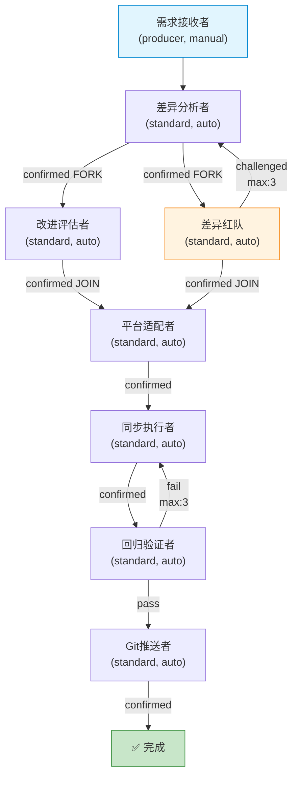

# APP 构建报告

## 一、构建概览

| 项目 | 内容 |
|------|------|
| **目标 APP 名称** | engine-win-sync-builder |
| **构建时间** | 2026-07-14 |
| **迭代轮次** | 第 1 轮 |
| **当前状态** | completed |
| **APP 类型** | 引擎 Windows 同步构建器（Mac→Win 改进同步 + 对抗审查 + 回归验证 + Git 推送） |

---

## 二、需求摘要

构建一个多角色 APP（`engine-win-sync-builder`），用于**自动将 Mac 验证过的 qoder-engine 仓库中的改进同步到 Windows 版引擎，并推送到目标 Git 仓库**。APP 包含 8 个角色（含 producer 入口 + 差异红队对抗角色），覆盖 Win 版代码获取→差异分析→对抗审查→改进评估→平台适配→同步执行→回归验证→Git 推送的完整闭环。同步覆盖 `engine/scripts/`（17 文件）、`engine/sdk/`（4 文件）、`engine/schemas/`（4 文件）全部核心组件。

需求文档经过 3 轮校验 + 2 轮红队挑战，修复了 3 项 MAJOR 缺陷（对抗回路设计、改进评估者产出物、Win 版代码来源）和 10 项 MINOR 缺陷，最终通过全部验收。

---

## 三、生成的架构总览

### 角色清单

| # | 角色 | 类型 | confirm | 职责 |
|---|------|------|---------|------|
| 1 | 需求接收者 | producer | manual | 接收同步需求，克隆 Win 版仓库到 `{workspace}/win-repo-clone/`，记录克隆路径和 commit hash，产出结构化需求文档 |
| 2 | 差异分析者 | standard | auto | 逐文件对比 Mac 版（工作区）vs Win 版（克隆目录）引擎代码，识别新增/修改/删除，覆盖 17+4+4 文件，产出差异分析报告 |
| 3 | 差异红队 | standard | auto | 对抗角色：5 维度挑战差异分析完整性（文件覆盖/识别准确性/平台差异/隐藏兼容性/变更影响范围），confirmed→JOIN，challenged→回退差异分析者 |
| 4 | 改进评估者 | standard | auto | 对每个差异分类评估：改进/平台差异/回退/无关变更，产出独立的改进评估报告（含待同步改进清单、同步优先级） |
| 5 | 平台适配者 | standard | auto | 基于改进评估报告+红队对抗报告，设计 Mac→Win 适配方案（路径分隔符/换行符/Shell/环境变量），产出同步设计文档 |
| 6 | 同步执行者 | standard | auto | 按同步设计文档逐项修改 Win 版引擎代码（克隆目录中的文件），产出变更摘要 |
| 7 | 回归验证者 | standard | auto | 六维验证同步后引擎正确性（Python语法/编译链路/DAG可达性/Schema校验/幂等性/版本号一致性），pass→推送，fail→回退同步执行者 |
| 8 | Git推送者 | standard | auto | 终态角色：推送同步后代码到目标仓库（含失败重试 3 次指数退避），整合全链路产出，产出推送报告 |

### 流程拓扑（Mermaid 图）

**回路设计：**
- **需求校验回路**：需求接收者（校验）fail → 需求接收者（producer 自动展开，局部回退，用户控制节奏）
- **对抗回路**：差异红队 challenged → 差异分析者（backward, max_executions: 3）
- **质量回路**：回归验证者 fail → 同步执行者（backward, max_executions: 3）

**并行设计：**
- 差异分析者 confirmed → [FORK] 并行扇出到改进评估者 + 差异红队
- [JOIN] 改进评估者 + 差异红队 confirmed → 平台适配者（同步汇入）

---

## 四、生成的文件清单

### 角色技能文件（8 × 2 = 16 文件）

| 角色 | skill.md | schema.json |
|------|----------|-------------|
| 需求接收者 | `roles/需求接收者/skill.md` | `roles/需求接收者/schema.json` |
| 差异分析者 | `roles/差异分析者/skill.md` | `roles/差异分析者/schema.json` |
| 差异红队 | `roles/差异红队/skill.md` | `roles/差异红队/schema.json` |
| 改进评估者 | `roles/改进评估者/skill.md` | `roles/改进评估者/schema.json` |
| 平台适配者 | `roles/平台适配者/skill.md` | `roles/平台适配者/schema.json` |
| 同步执行者 | `roles/同步执行者/skill.md` | `roles/同步执行者/schema.json` |
| 回归验证者 | `roles/回归验证者/skill.md` | `roles/回归验证者/schema.json` |
| Git推送者 | `roles/Git推送者/skill.md` | `roles/Git推送者/schema.json` |

### 知识文档（3 文件）

| 知识文件 | 路径 | 注入角色 |
|---------|------|---------|
| 编排范式.md | `knowledge/编排范式.md` | 差异分析者、回归验证者 |
| SDK_SPEC.md | `knowledge/SDK_SPEC.md` | 差异分析者、回归验证者 |
| Windows平台适配知识.md | `knowledge/Windows平台适配知识.md` | 平台适配者、同步执行者、回归验证者 |

### 架构配置文件

| 文件 | 路径 | 说明 |
|------|------|------|
| app.yaml | `app.yaml` | 声明式编排配置（8 角色 + 9 边 + 3 知识注入 + 8 节设计注释） |
| 需求文档 | `00-需求描述.md` | 结构化需求文档（十大要素） |

### 文件统计

| 统计项 | 数量 |
|--------|------|
| 角色总数 | 8 |
| skill.md 文件 | 8 |
| schema.json 文件 | 8 |
| 知识文档 | 3 |
| **文件总数** | **19** |
| 有知识注入的角色 | 5 |
| 无知识注入的角色 | 3 |

---

## 五、验证结果摘要

### 模拟验证（七维 dry-run）

| 维度 | 状态 | 说明 |
|------|------|------|
| 维度一：DAG 可达性分析 | ✅ PASS | 8 角色从入口可达，8 角色可达完成终态，无孤立角色 |
| 维度二：verdict 出边完备性 | ✅ PASS | 8 个 schema.json verdict enum 与 edges when: 完全对应，无悬空 verdict |
| 维度三：数据流完整性 | ✅ PASS | 所有角色输入物料均有上游产出，类型和路径对齐 |
| 维度四：loop 收敛性 | ✅ PASS | 2 条 backward 回路（对抗 max:3 + 质量 max:3）收敛，无无限循环 |
| 维度五：语义一致性 | ✅ PASS | 8 个 skill.md 路由语义与 app.yaml edges 完全一致 |
| 维度六：知识文档数据流 | ✅ PASS | 3 知识文档 inject_to 三方一致（app.yaml / 技能填充报告 / skill.md） |
| 维度七：skill↔schema 格式 | ✅ PASS | 8 个 schema.json 格式规范，产出物与 _required_files 一致 |

**验证统计**：7/7 维度通过，42 项 INFO findings，0 critical/major/minor 缺陷

### 三路并行审阅

| 审阅路径 | verdict | 检查项 | 通过 | 失败 |
|---------|---------|--------|------|------|
| 结构审阅者 | ✅ confirmed | 21 | 21 | 0 |
| 合规审阅者 | ✅ confirmed | 18 | 18 | 0 |
| 架构红队 | ✅ confirmed | 6 维压力测试 | 6 | 0 |

**合并规则**：三路全部 confirmed → 综合裁决 = confirmed

### 架构红队发现项汇总

| 严重级别 | 数量 | 架构缺陷 | 引擎范式约定 | 设计权衡 |
|---------|------|---------|------------|---------|
| CRITICAL | 0 | — | — | — |
| MAJOR | 4 | 0 | 3 | 1 |
| MINOR | 3 | 0 | 1 | 2 |

> 4 项 MAJOR 经裁决审计者逐项复核，均为引擎范式约定或合理设计权衡，非 app.yaml 架构缺陷。

### 循环终止性数学证明

- 对抗回路：差异红队 challenged → 差异分析者，max_executions: 3，最多执行 4 次（初始 1 + 3 次回退）
- 质量回路：回归验证者 fail → 同步执行者，max_executions: 3，最多执行 4 次
- 两条回路时序不相交，无死锁/饥饿/无限循环风险

---

## 六、TRACK 追踪

### TRACK 统计总览

| 统计维度 | 数量 |
|---------|------|
| **TRACK 总数** | **25** |
| 已修复（fixed） | 13 |
| 设计权衡（design_tradeoff） | 4 |
| 引擎范式约定（engine_paradigm_convention） | 3 |
| 文档改进建议（improvement_suggestion） | 5 |
| CRITICAL | 0 |
| MAJOR | 7（3 已修复 + 4 设计权衡/范式约定） |
| MINOR | 18（10 已修复 + 5 文档建议 + 3 设计权衡/范式约定） |
| SDK_SPEC 演进提案 | 0 |

### TRACK 来源分布

| 来源 | 数量 | 说明 |
|------|------|------|
| 需求校验第1轮 | 3 | 文档结构/计数/残留文本（全部已修复） |
| 需求红队第1轮 | 10 | 3 MAJOR + 7 MINOR（全部已修复） |
| 需求红队第2轮 | 5 | 5 MINOR 文档措辞改进建议（非阻塞） |
| 架构红队 | 7 | 4 MAJOR（设计权衡/范式约定）+ 3 MINOR（文档gap/设计权衡） |

### TRACK 明细

#### 已修复 TRACK（13 项）

| ID | 来源 | 严重级别 | 描述 | 修复轮次 |
|----|------|---------|------|---------|
| TRACK-001 | 需求校验第1轮 | MINOR | 文档类型数量描述与实际不符 | 需求接收者-round1修订 |
| TRACK-002 | 需求校验第1轮 | MINOR | 文件计数不准确 | 需求接收者-round1修订 |
| TRACK-003 | 需求校验第1轮 | MINOR | 残留文本未清理 | 需求接收者-round1修订 |
| TRACK-004 | 需求红队第1轮 | **MAJOR** | 对抗回路设计错误（challenged→平台适配者，应为→差异分析者） | 需求接收者-round2修订 |
| TRACK-005 | 需求红队第1轮 | **MAJOR** | 改进评估者无显式产出物 | 需求接收者-round2修订 |
| TRACK-006 | 需求红队第1轮 | **MAJOR** | Win版代码来源未指定 | 需求接收者-round2修订 |
| TRACK-007 | 需求红队第1轮 | MINOR | AC-5 sdk文件数从3更正为4 | 需求接收者-round2修订 |
| TRACK-008 | 需求红队第1轮 | MINOR | 差异红队5维度增加具体检测项 | 需求接收者-round2修订 |
| TRACK-009 | 需求红队第1轮 | MINOR | 回归验证者增加幂等性检查维度 | 需求接收者-round2修订 |
| TRACK-010 | 需求红队第1轮 | MINOR | Git推送者增加推送失败重试逻辑 | 需求接收者-round2修订 |
| TRACK-011 | 需求红队第1轮 | MINOR | L2与L1依赖关系细化 | 需求接收者-round2修订 |
| TRACK-012 | 需求红队第1轮 | MINOR | 新增AC-17版本号一致性检查 | 需求接收者-round2修订 |
| TRACK-013 | 需求红队第1轮 | MINOR | 知识依赖增加Windows平台适配知识 | 需求接收者-round2修订 |

#### 设计权衡 / 引擎范式约定 TRACK（7 项，非阻塞）

| ID | 来源 | 严重级别 | 描述 | 裁决结论 |
|----|------|---------|------|---------|
| TRACK-019 | 架构红队 S1-F2 | **MAJOR** | standard角色Gate FAIL无显式恢复边 | 引擎范式约定，auto-confirm角色Gate FAIL由引擎统一处理 |
| TRACK-020 | 架构红队 S1-F3 | **MAJOR** | Git推送者推送失败后仍到达完成态 | 合理设计权衡，终态角色产出报告而非阻塞流水线 |
| TRACK-021 | 架构红队 S2-F1 | **MAJOR** | FORK重触发时JOIN竞态风险 | 风险在引擎实现层，app.yaml拓扑设计本身正确 |
| TRACK-022 | 架构红队 S5-F2+F3 | **MAJOR** | max_executions耗尽异常终止依赖router默认逻辑 | 引擎标准行为，循环终止性已数学证明 |
| TRACK-024 | 架构红队 S5-F3 | MINOR | 质量回路3次fail后无自动回滚 | 设计权衡，win-repo-clone/是临时目录可重新克隆 |
| TRACK-025 | 架构红队 S6-F3 | MINOR | producer校验回路无max_executions上界 | 设计约定，manual confirm保证不会无限循环 |
| TRACK-023 | 架构红队 S4-F2 | MINOR | carries注入物未在inputs中声明 | 文档gap，carries是引擎标准机制，§5已定义 |

#### 文档改进建议 TRACK（5 项，非阻塞）

| ID | 来源 | 严重级别 | 描述 |
|----|------|---------|------|
| TRACK-014 | 需求红队第2轮 | MINOR | 需求文档部分措辞可进一步精确化 |
| TRACK-015 | 需求红队第2轮 | MINOR | 部分技术描述的精确度可提升 |
| TRACK-016 | 需求红队第2轮 | MINOR | 验收标准表述可更规范 |
| TRACK-017 | 需求红队第2轮 | MINOR | 角色职责描述可更精炼 |
| TRACK-018 | 需求红队第2轮 | MINOR | 协作流程图可进一步细化 |

### SDK_SPEC 演进评估

本轮无 TRACK 涉及 SDK_SPEC 规范本身的改进。所有 TRACK 均为 APP 层面的需求/架构/文档问题，不涉及引擎 SDK 接口规范、return-package 格式、verdict 语义等 SDK_SPEC 定义的规范的变更需求。

---

## 七、下一步建议

### 当前状态：completed ✅

engine-win-sync-builder APP 构建已完成。所有 MAJOR TRACK 已修复或经裁决审计者确认为设计权衡/引擎范式约定（非架构缺陷），无 CRITICAL 缺陷，无 SDK_SPEC 演进提案。8 角色 × 2 文件 + 3 知识文档共 19 个文件全部生成，模拟验证七维全通过，三路审阅全部 confirmed，裁决审计者终审确认。

### 建议事项

1. **立即可执行**：APP 已具备运行条件，用户可启动 `engine-win-sync-builder` APP 执行 Mac→Win 引擎同步任务

2. **后续文档优化**（非阻塞，可择机处理）：
   - TRACK-014~018：需求文档措辞精确化改进（5 项 MINOR）
   - TRACK-023：在差异分析者和同步执行者的 skill.md 中显式声明 carries 注入物的读取逻辑
   - TRACK-024：推送报告或异常终止通知中增加"异常终止时代码状态诊断"字段

3. **引擎层面关注**（依赖引擎迭代，非 APP 层面）：
   - TRACK-019：引擎对 auto-confirm standard 角色 Gate FAIL 的统一处理行为需在 SDK_SPEC 中进一步明确
   - TRACK-021：引擎实现层的 FORK 重触发级联失效调度机制
   - TRACK-022：引擎 router 的 max_executions 耗尽异常终止兜底行为

4. **运行时注意事项**：
   - 首次运行前确认 `git@github.com:xp-lv/qoder-engine-win.git` 可访问（SSH 密钥配置）
   - 对抗回路和质量回路各设 max_executions: 3，若频繁触发回退需检查差异分析质量或同步代码正确性
   - Git推送者推送失败后会产出诊断报告（含重试日志），即使流水线标记完成也需检查推送报告中的 push_status 字段

---

> 本构建报告由 app-builder 的「知识管理者」角色产出，标志 engine-win-sync-builder APP 第 1 轮构建完成。
