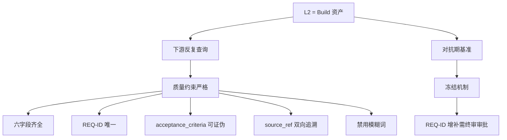

# L2 需求规格编写指南

## 目的

本文档是 L2 需求规格文档的**业务编写权威源**——只关心"L2 怎么写好"。L2 是 3 轮对抗期红队的**唯一对照源**，其质量直接决定整个对抗期的有效性。

> **职责边界**：本文档只覆盖业务规则（L2 文件结构、REQ-ID 体系、L1 充分性检查、L2 完整性自检、REQ-ID 增补 L2 更新的业务操作）。
> **SDK 陷阱规避**（如 manual confirm 路由语义）→ 见《C1路由语义说明》，二者正交、独立演进。

**v2 修订说明**：补全 L2 作为"Build 资产"的价值论证（卷一补 §2）、REQ-ID 体系的工程经济学依据、模糊词禁止与可证伪性的哲学依据、L1 充分性检查的信息论基础。

---

## 设计哲学：L2 为什么这么重要（v2 新增·先读这一段）

> 本节解释"为什么 L2 不是文档，是资产"。理解了这一点，下面的所有字段约束就不是"要遵守的规范"，而是"必须这么做的工程理由"。

### L2 是 Build 资产，不是 Run 产物

这是本指南最重要的认知。L2 不是"需求文档"这么简单，它是**后续所有工作的基准线**：

```
L1 原始诉求 → [L2 需求规格] → 架构蓝图 → 实施 → 测试 → 运维
                     ↑
                这里是分水岭
                     |
      上游：需求、业务、语义、用户语言
                     |
      下游：架构、技术、实施、工程语言
```

L2 是 Build 资产的意思是：**L2 一次产出，下游反复使用**。架构师查 L2 找 REQ-ID，红队查 L2 找 acceptance_criteria，终审查 L2 验证追溯链——这些查询每一天、每一轮对抗都在发生。

如果 L2 质量差（语义模糊、REQ-ID 重复、acceptance_criteria 不可证伪），整个下游都被污染——所有查询都会返回错误结果。这就是为什么 L2 的质量约束这么严格。

**卷一补 §2.7 Build-Run 分层原则**给出的明确论据：
> "L2 是后续对抗的'基准'——这其实是 Build 资产。"

### L2 质量差的代价：为什么必须这么严

L2 字段约束不是"吹毛求疵"，每个约束都防止一种系统性失效：

| 约束 | 防止的失效 | 代价量级 |
|------|----------------------|---------|
| 六字段齐全 | 某条需求语义不全 | 架构师猜测补全 → 蓝图偏离需求 → 上线后才发现 |
| REQ-ID 唯一 | 需求身份混乱 | 架构师不知道响应哪条 → 对抗记录追溯链断裂 |
| acceptance_criteria 可证伪 | 红队无法判定是否达标 | 对抗机制火药味不足 → 质量门失效 |
| source_ref 双向可追溯 | 需求来源不可追 | 谁也说不清这条需求是谁说的 → 需求变更无法评估影响 |
| 禁用模糊词 | 判定主观化 | 红队/架构师各说各话 → 对抗退化成满嘴争辩 |

L2 质量差是**质能代价不对称**的典型：L2 上省 1 小时，下游要付 100 小时。

### 为什么 L2 在对抗期必须冻结

冻结不是"流程仪式"，是**保证对抗机制有效的前提条件**。

对抗机制依赖"基准 vs 设计"的比较——红队查的是"蓝图是否满足 L2"。如果 L2 在对抗期不断变，比较的基准就不存在了：
- 红队昨天查了"蓝图满足 L2 v1"，今天 L2 变成 v2，红队的发现作废
- 架构师响应红队的依据是 L2 v1，但红队复查时看的是 L2 v2，响应链断裂
- 终审无法做"需求-蓝图追溯"，因为追溯的源头在动

冻结 = 对抗机制的参考系不动。这是相对论级别的工程要求——参考系动，所有测量都失效。

REQ-ID 增补流程是唯一解冻路径，设计上让解冻变得"昂贵"（需终审审批）——防止解冻变成随手习惯。

### 本指南的所有约束与 L2 价值的对应总览



## 适用角色
- **需求分析师**（L2 唯一产出者）
- 红队（间接对照，按 L2 的 REQ-ID 体系做落位校验）
- 架构设计师（按 L2 产蓝图；通过 carries 中 REQ-ID增补审批.json 识别"增补后重跑"）

---

## 一、L2 文件结构

L2 文件路径：`outputs/需求规格文档.md`，由两部分组成：

1. **YAML front-matter**（结构化索引）：Gate 程序化读取此段构建 `registered_ids` 集合
2. **Markdown 主体**（散文式描述）：每条 REQ 的详细说明

### 1.1 标准 front-matter 字段

```markdown
---
schema_version: L2-v1
requirements:
  - req_id: REQ-001
    title: 简短标题
    description: 需求点描述
    acceptance_criteria:
      - "可证伪判据 1"
      - "可证伪判据 2"
    priority: high | medium | low
    source_ref: L1 §X.Y
  - req_id: REQ-002
    ...
---

# L2 需求规格文档

## REQ-001 简短标题
（详细描述、边界、约束等）

## REQ-002 简短标题
（详细描述、边界、约束等）
```

### 1.2 条件 front-matter 字段（场景相关）

| 字段 | 触发场景 | 用途 |
|------|---------|------|
| `status: blocked_on_l1_clarification` | L1 不充分时占位 L2 | 标识占位状态，等待用户 reject → 更新 L1 |
| `clarification_request_id: CLR-001` | L1 不充分时占位 L2 | 关联需求澄清请求 ID |
| `inferred_fields` | L1 充分但含歧义 | 列出推断字段及推断依据 |
| `version: v2` | REQ-ID 增补后 L2 更新 | 版本号 +1，标识"已增补"，供审计追溯 |

---

## 二、每条 requirement 必填字段（AC-10 可证伪）

### 2.1 Why：为什么是这六个字段

这六字段不是随意列举，是**需求工程领域的最小可行 schema**（IEEE 830-1998 + ISO/IEC 29148:2018 的简化版）。每个字段都防止一种系统性失效：

| 字段 | 防止的失效 | Why（工程理由） |
|------|----------------------|--------------|
| `req_id` | 需求身份丢失 | 唯一 ID 是追溯的基础。架构师/红队/终审都靠这个 ID 交流，丢了或重复了，追溯链断裂 |
| `title` | 需求语义压缩丢失 | ≤30 字迫使需求分析师提炼出"这个需求一句话能说清是什么"。说不清 = 没想透 |
| `description` | 需求上下文丢失 | 散文式描述保留需求背景。架构师做设计决策时需要知道"为什么有这条需求" |
| `acceptance_criteria` | 需求是否达标的判定丢失 | 这是红队唯一能查的"可证伪判据"。丢了 = 红队只能主观判断 = 对抗机制失效 |
| `priority` | 资源分配无依据 | 高/中/低使架构师知道哪些必须做、哪些可缓。丢了 = 所有需求被等价对待 = 重点意识丢失（违背 60% 公式）|
| `source_ref` | 需求来源不可追 | 必须能 grep 命中 L1。丢了 = 谁也说不清这条需求从哪里来 = 后期变更无法评估影响范围 |

### 2.2 字段详细定义

| 字段 | 类型 | 约束 | Gate 校验 |
|------|------|------|----------|
| `req_id` | string | 正则 `^REQ-\d{3,4}$`（如 REQ-001 ~ REQ-9999）；**L2 内唯一**（不可重复） | 必填 + 唯一性 + 正则匹配 |
| `title` | string | ≤ 30 字 | 必填 |
| `description` | string | 散文式但需明确无歧义 | 必填 |
| `acceptance_criteria` | array | ≥ 1 条；每条可证伪；**禁用"合理""适当"等模糊词**（high-⑥）| 必填 + 条数 ≥ 1 |
| `priority` | enum | `high` / `medium` / `low` | 必填 + 枚举校验 |
| `source_ref` | string | `L1 §X.Y`，**必须能在 L1 中 grep 命中**（双向可追溯） | 必填 + L1 grep 校验 |

**约束**：
- **必填字段缺失** → Gate 校验直接判 L2 fail，需求分析师必须补全后重出
- **REQ-ID 唯一性** → 同一 L2 内 `req_id` 不可重复，Gate 校验
- **acceptance_criteria 每条必须可证伪** → 禁用"合理""适当""较快""足够"等模糊词（与 §5.4 high-⑥ 一致）
- **source_ref 必须在 L1 中可 grep 命中** → 双向可追溯，Gate 校验

---

## 三、L1 充分性检查（产 L2 前必做）

### 3.1 Why：为什么是这四要素

L1 充分性检查不是"吹毛求疵"，是**信息论意义上的必要条件**——L1 如果信息量不足，L2 无论怎么写都会包含虚构内容。

四要素分别对应需求工程的四个核心问题：

| 要素 | 对应的核心问题 | 缺失的后果 | Why |
|------|---------------|-----------|-----|
| **目标** | 这个系统要解决什么问题？ | L2 不知道做什么 → 需求分析师虚构目标 → 整个架构为错误问题服务 | 没目标的系统不是系统，是玩具 |
| **角色** | 这个系统给谁用？ | L2 不知道用户是谁 → 需求分析师假设"通用用户" → 需求被无差别打包 → 部分用户被错待 | 软件本质是为人服务，不知道人是谁就不能设计交互 |
| **边界** | 这个系统不管什么？ | L2 不知道边界 → 需求分析师默认什么都做 → scope creep → 项目失控 | 软件工程 50 年教训：项目失控都是从"什么都要做"开始的（Brooks, 1975） |
| **验收** | 怎么算做完了？ | L2 不知道验收信号 → 需求分析师虚构判据 → 项目永远"快完了" | 没有验收的项目不会结束。这不仅是工程问题，是组织信任问题 |

**架构思想依据**：这四要素是 INVEST 原则（Independent/Negotiable/Valuable/Estimable/Small/Testable，Bill Wake 2003）的前置条件——INVEST 是"好需求"的标准，四要素是"需求可被 INVEST 评估"的前提。

### 3.2 检查规则

需求分析师在产 L2 前**必须**对 L1（00-需求描述.md）做充分性检查，**四要素任一缺失即判 L1 不充分**：

| 要素 | 判据 | Gate 校验手段 |
|------|------|-------------|
| **目标** | L1 必须能 grep 出"目标 / 想要 / 实现 / 构建 / 设计"等意图关键词，且意图描述非空 | grep L1 命中关键词 |
| **角色** | L1 必须显式或隐式提及 ≥ 2 个角色（含 1 个产出角色入口） | 人工/语义判定 |
| **边界** | L1 必须能识别"做什么"+"不做什么"的边界（"不做什么"可缺省，但"做什么"不可缺） | 人工/语义判定 |
| **验收** | L1 必须含至少 1 条可证伪的验收信号（即便是粗粒度的"产出 X 文件"） | grep L1 命中"验收 / 通过 / 完成"等信号词 |

### 3.1 L1 充分但含歧义

L1 充分但含歧义时，需求分析师**可**基于合理推断补全 L2，但**必须**在 L2 front-matter 中标注 `inferred_fields`：

```yaml
---
schema_version: L2-v1
inferred_fields:
  - req_id: REQ-005
    field: acceptance_criteria
    inference_basis: "L1 §3.2 描述含糊，基于上下文推断『系统应支持并发 100』"
requirements:
  ...
---
```

> 后续红队可对推断字段提出 problem（依据 high-⑥"验收标准无法证伪"或 medium-①）。

### 3.2 L1 不充分（含自相矛盾）

L1 不充分（含两处描述冲突的自相矛盾）时，需求分析师**禁止强行产出完整 L2**。业务产出要求：

1. **产出 `outputs/需求澄清请求.md`（Markdown 格式）**，包含：
   - `request_id`：澄清请求 ID（如 CLR-001）
   - `missing_elements`：缺失的四要素之一（如 `["目标", "验收"]`）
   - `specific_questions`：具体可回答的问题清单
   - `blocked_at`：固定填 `L1→L2`
   - `status`：固定填 `l1_insufficient`（**文档语义标识**）

2. **同时产出占位 L2**（满足 Gate `_required_files` 物理存在性校验），front-matter 加 `status: blocked_on_l1_clarification`，`requirements` 为空数组。

> **路由如何实现？** 这是 SDK 机制问题，不在本文档范畴。详见《C1路由语义说明》陷阱 1。

---

## 四、L2 完整性自检清单

**产出 L2 前必须逐条自检**，自检不通过**禁止**输出 `confirmed`：

- [ ] YAML front-matter 六字段齐全（req_id / title / description / acceptance_criteria / priority / source_ref）？
- [ ] 每条 req_id 唯一且匹配正则 `^REQ-\d{3,4}$`？
- [ ] 每条 acceptance_criteria ≥ 1 条，且每条可证伪（无"合理""适当"等模糊词）？
- [ ] 每条 source_ref 在 L1 中可 grep 命中（双向可追溯）？
- [ ] priority 字段取值 ∈ {high, medium, low}？
- [ ] 推断字段（如有）是否在 inferred_fields 中标注？

**产出需求澄清请求.md + 占位 L2 时（L1 不充分场景）**，逐项自查：
- [ ] missing_elements 是否列出缺失的四要素之一？
- [ ] specific_questions 是否具体可回答（非泛泛）？
- [ ] blocked_at 是否填 `L1→L2`？
- [ ] status 字段是否填 `l1_insufficient`？
- [ ] 是否同时产出占位 L2（front-matter 加 `status: blocked_on_l1_clarification`，requirements 为空数组）？

---

## 五、L2 对抗期冻结规则

### 5.1 冻结时机

- 需求分析师经用户 manual confirm → L2 冻结，对抗期启动
- 冻结后 3 轮对抗期红队以此 L2 为唯一对照源

### 5.2 REQ-ID 增补流程（§9.4，唯一解冻路径）

对抗期发现隐含需求时，**必须**走 REQ-ID 增补流程：

1. 架构师在响应记录中标注 `unregistered_requirement` + 隐含需求语义 + 推演依据
2. 架构师输出 `unregistered_requirement` verdict → 终审审批
3. **批准 `reqid_approved`** → 需求分析师执行 L2 解冻-写入-重冻结（详见 §六）
4. **驳回 `reqid_rejected`** → 架构师按现有 L2 完成 response
5. **次数限制**：整个对抗期最多 2 次 REQ-ID 增补

> **路由如何实现？** 详见《C1路由语义说明》陷阱 2。

---

## 六、REQ-ID 增补 L2 更新流程

### 6.1 触发条件

终审裁决者输出 `reqid_approved` → 路由到需求分析师。

### 6.2 业务执行步骤（L2 解冻-写入-重冻结）

1. 读取终审审批文件（含 `proposed_req_id` + `semantic_description` + `inference_basis`）
2. **L2 解冻-写入-重冻结**：
   - 解冻 L2
   - 在 front-matter requirements 数组追加新 REQ-ID（按 L2 现有最大编号 +1，与审批中 proposed_req_id 一致）
   - L2 版本号 +1（更新 `version` 字段，如 `v1 → v2`）
   - **不可修改既有 REQ**（仅追加）
   - 重冻结
3. 将更新后的 L2 写回 `outputs/需求规格文档.md`

### 6.3 业务校验

- [ ] 仅在 requirements 数组追加（不改既有 REQ）？
- [ ] 新 REQ-ID = 现有最大编号 +1，且与审批中 proposed_req_id 一致？
- [ ] L2 版本号 +1（version 字段）？

---

## 七、编写要点

### 7.1 REQ-ID 分配原则

**Why**：REQ-ID 是整个系统的"身份证号"。它的不变性保证了对抗期、实施期、运维期都能查到同一条需求。

- 按 L1 中的需求点出现顺序分配（REQ-001, REQ-002, ...）
- 每条 REQ 应是一个独立可验证的需求点（不要把多个需求塞进一个 REQ）
- REQ-ID 一旦分配，**永不变更**（即使后续修订也只能增补新的，不能重排）

**为什么不能重排**：重排会破坏所有下游引用。架构师引用了 REQ-017，如果后续把 REQ-017 重排为 REQ-021，所有引用全部失效。这是"不变性原则"（Immutability Principle）在需求工程中的应用。

### 7.2 acceptance_criteria 编写原则

**Why**：acceptance_criteria 是红队唯一的判定依据。不可证伪 = 红队无法判定 = 对抗机制火药味不足。

- **每条必须可证伪**：能客观判定通过 / 不通过
- **禁用模糊词**：禁用"合理""适当""较快""足够""良好"等无法量化的词
- **量化优先**：用具体数值（如"响应时间 ≤ 200ms"）替代定性描述（如"响应较快"）

```
✅ 正例：
- "密码至少 8 字符，含数字和字母"
- "5 次失败后锁定账户 15 分钟"
- "支持并发 100 用户"

❌ 反例（high-⑥）：
- "密码强度合理"
- "失败后合理时间锁定"
- "支持高并发"
```

**为什么模糊词这么危险**：模糊词的本质是**让判定者主观解读**。不同的判定者（红队 A / 红队 B / 架构师 / 终审）会给出不同的解读——对抗机制退化成"主观看似合理"的争论。Karl Popper 的可证伪性原则（1934）："一个无法被证伪的命题是信仰，不是科学。"软件工程中，不可证伪的判据是信仰，不是需求。

### 7.3 source_ref 编写原则

**Why**：source_ref 是需求追溯链的错。丢了 = 需求来源不可追 = 后期变更无法评估影响范围。

- 必须引用 L1 中的具体章节（如 `L1 §3.2`）
- 必须能在 L1 中 grep 命中（Gate 校验）
- 实现 L2 ↔ L1 双向可追溯

**为什么必须双向**：
- 正向（L1 → L2）：L1 提到的东西必须被 L2 接住 → 防止需求丢失
- 反向（L2 → L1）：L2 写的东西必须能在 L1 找到来源 → 防止需求分析师虚构需求

这是 IEEE 830-1998 需求标准的核心要求："每条需求必须能追溯到其来源"。

---

## 八、示例：完整 L2 文档

```markdown
---
schema_version: L2-v1
version: v1
requirements:
  - req_id: REQ-001
    title: 用户身份认证
    description: 系统必须支持用户名 + 密码方式登录，并通过强度校验。
    acceptance_criteria:
      - "密码至少 8 字符，含数字和字母"
      - "5 次失败后锁定账户 15 分钟"
      - "会话 30 分钟无操作自动失效"
    priority: high
    source_ref: L1 §3.1
  - req_id: REQ-002
    title: 数据持久化
    description: 用户数据必须持久化到关系型数据库，并支持事务。
    acceptance_criteria:
      - "数据库写入失败时事务回滚"
      - "支持按用户 ID 查询（响应 ≤ 100ms）"
    priority: high
    source_ref: L1 §3.2
---

# L2 需求规格文档

## REQ-001 用户身份认证
（详细描述）

## REQ-002 数据持久化
（详细描述）
```

---

## 九、示例：占位 L2（L1 不充分场景）

```markdown
---
schema_version: L2-v1
status: blocked_on_l1_clarification
clarification_request_id: CLR-001
requirements: []
---

# L2 需求规格文档（占位）

> 状态：blocked_on_l1_clarification
> 关联请求：CLR-001
> 说明：L1 充分性四要素检查未通过（缺失：目标、验收）。等待用户更新 L1 后重新产出完整 L2。
```
