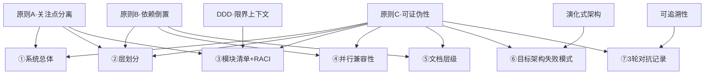

# 架构蓝图规范

## 目的
本文档为架构设计师提供架构蓝图的**强制章节结构、REQ-ID 落位规则、架构师响应机制、版本演进规范、M2 修复跨层回退归档流程、F3-001 增补后重跑信号识别（C1 修复配套）**。蓝图必须满足 AC-1 ~ AC-7 的可证伪校验，且每个 REQ-ID 的落位必须通过 high-① 最小形态三要素检查。

**v2 修订说明**：M2 修复跨层回退归档 + F3-001 增补后重跑信号识别 已提取到《SDK陷阱规避》独立文档（机制约束与业务规范分离原则）。

**v3 修订说明**：每个强制章节补"为什么这一章是必要的"论证段（Why 推理链），让架构师理解设计意图而非机械填章节。融入架构整洁之道（Clean Architecture）、领域驱动设计（DDD）、卷一补方法论三原则的认知深度。

---

## 设计哲学（v3 新增·先读这一段）

> 本节是整份规范的"道"，下面 7 个章节是"术"。读明白本节，7 个章节的必要性就自然成立。

### 架构是什么

架构不是"画图"，而是**对系统性决策的显式记录**。架构师的工作不是发明结构，而是回答以下 4 个核心问题（Ralph Johnson 的定义）：

| 问题 | 含义 | 不回答的后果 |
|------|------|------------|
| **什么是组件** | 系统由哪些独立单元组成 | 模块边界混乱，责任不清 |
| **什么是关系** | 组件之间如何通信、依赖、协作 | 隐式依赖堆积，改一处动全身 |
| **什么是边界** | 每个组件的职责边界在哪里 | 职责泄漏，单一组件膨胀 |
| **什么是依据** | 每个决策为什么这么定 | 决策无 trace，后期无法评估适配度 |

7 个强制章节本质就是这 4 个问题的工程化拆解。

### 架构的 3 个不可妥协原则

下面 3 条原则是**本规范所有约束的元依据**，任何约束如果不明所以然，回到这 3 条找根：

#### 原则 A：关注点分离（Separation of Concerns, Dijkstra 1974）

> "以不同的视角看待问题，并把不同的视角独立出来。"

**对应的章节**：①系统总体 / ②层划分 / ③模块清单。

**为什么不能妥协**：当多个关注点混在一个组件里，任何变更都会引发连锁修改（spaghetti code 的根源）。这是软件复杂度的最大来源（Out of the Tar Pit, 2006）。

**判别**：如果你写某个模块时脑子里同时在想 3 件不相关的事（如"我要处理订单+要校验权限+要写日志"），就是违反了 SoC。

#### 原则 B：依赖倒置（Dependency Inversion, Robert C. Martin 1996）

> "高层模块不应依赖低层模块；二者都应依赖抽象。抽象不应依赖细节；细节应依赖抽象。"

**对应的章节**：②层划分（单向依赖约束）+ ③模块清单（接口声明）。

**为什么不能妥协**：依赖方向决定了变更的传播方向。如果高层依赖低层的具体实现，那么低层的任何变更都会逼高层改写——架构变成了"脆弱的 Jenga 塔"。倒置依赖后，低层变更不再影响高层，系统获得了**可演进性**。

**判别**：画一张依赖箭头图，如果箭头指向"更具体的实现"，就是违反了 DIP。

#### 原则 C：可证伪性（Falsifiability, Karl Popper 1934）

> "一个无法被证伪的命题是信仰，不是科学。"

**对应的章节**：所有章节都必须含"可证伪的判据"，禁止模糊词（high-⑥）。

**为什么不能妥协**：架构是工程，工程必须能被验证。"性能合理""扩展性良好"是信仰——既不能证明成立，也不能证明不成立，于是红队无法查、架构师无法改。可证伪判据（如"响应 ≤ 200ms""并发 ≥ 100"）让架构回到了工程范畴。

**判别**：如果你写的判据无法用 grep/数值/对照实验任一方式验证，就是违反了可证伪性。

### 本规范的 7 章节与 3 原则的对应总览



## 适用角色
- 架构设计师（蓝图产出者，强制遵循本规范，含 M2 归档 + F3-001 信号识别）
- 3 轮红队（间接对照，验证蓝图是否符合本规范）

## 一、7 个强制章节（AC-2 可证伪）

蓝图必须包含以下 7 个章节（grep 章节标题可证伪）：

| 序号 | 章节标题 | 内容要点 |
|------|---------|---------|
| ① | **系统总体** | 系统目标、核心能力、上下文图（输入/输出/边界）|
| ② | **层划分** | 系统分层（如表现层 / 业务层 / 数据层）、层间依赖关系、单向依赖约束。**R4 约束：分层 ≤ 4 层**（除非有充分理由，否则判 high-⑧）|
| ③ | **模块清单 + RACI** | 每个模块的名称、**独特能力声明**（"角色即能力"）、职责、接口；RACI 矩阵（每个关键产出物有 Responsible）。**R4 约束：每个模块必须有独特能力声明 + 核心业务模块占比 ≥ 60%**|
| ④ | **并行兼容性** | 并行角色/模块的资源访问约束（锁/序）；同步汇入 input_groups |
| ⑤ | **文档层级** | 系统涉及的文档类型及依赖关系（如 L1/L2/蓝图）；闭环检查 |
| ⑥ | **目标架构的失败模式与应对** | 三类失败模式：单点失效 / 依赖不可用 / 过载；每类含触发条件 + 应对策略 |
| ⑦ | **3 轮对抗记录** | R1/R2/R3 的问题清单 + 响应记录链 + severity 变化 + final_status |

> **F-009 消歧**：章节⑥明确为**目标架构（蓝图描述对象）的失败模式**，**不是**本 app 对抗流程的失败模式，**也不是**运维手册。

### 1.1 每个章节的 Why（为什么不可省略）

> 本节回答"为什么不能合并章节/省略某个章节"。架构师在设计偏离时，请回到本节找根。

#### ① 系统总体：为什么不能省

**省略的后果**：架构师直接跳到模块层，红队和实施者无法回答"这个系统的边界在哪里"。任何超出系统总体定义的需求都会被架构师自行决定要不要做——这就是需求 scope creep 的物理起源。

**架构思想依据**：上下文图（Context Map）是 DDD 战略设计的起点。没有上下文图，就无法判断每个模块的**限界上下文**（Bounded Context）是不是合理——因为"这个系统管什么"本身没定义。

**最低要求**：用一张图（输入来源 / 系统边界 / 输出去向）+ 一段核心能力描述。少于一图一段即不成立。

#### ② 层划分：为什么必须 ≤ 4 层

**省略的后果**：层次不清时，模块之间的依赖会形成网状（任意层依赖任意层）。这是"大泥球"（Big Ball of Mud）架构的典型特征——一切依赖一切，重构成本指数上升。

**为什么 ≤ 4 层是判据**：人类工作记忆容量是 7±2（Miller's Law, 1956）。当一个架构师要同时记住"这一层依赖哪些层"时，≤4 层让依赖关系可以**在脑中一次成像**；超过 4 层则需要分多次推理，遗漏风险陡增。

**R4 high-⑧ 的依据**："分层 > 4 且无充分理由"的"充分理由"包括——硬实时系统（嵌入式）、严格合规要求（金融/医疗）、遗留系统集成。**业务复杂度不是理由**——业务复杂应该拆模块，不应堆层级。

**架构思想依据**：Clean Architecture（Robert C. Martin, 2012）的同心圆——Entity → Use Case → Interface Adapter → Frameworks & Drivers，正好 4 层。任何更多层都是在重复这 4 层的职责。

#### ③ 模块清单 + RACI：为什么必须含独特能力声明

**省略"独特能力声明"的后果**：模块描述只剩"职责"时，会出现一种致命的退化为**"转发模块"**——一个模块只是把输入转给下一个模块，自己不做任何增值处理。这种模块是编排税，不是架构组件。

**为什么核心业务模块占比要 ≥ 60%**：60% 不是经验数字，是"架构重点意识"的工程化阈值（卷五 60% 公式的具体应用）。低于 60% 意味着"管理类/协调类/转发类"模块占主体，真正的业务承载模块被淹没——架构变成了"为编排服务的架构"，违背"架构是为业务服务的"第一原则。

**RACI 的本质**：RACI 不是管理学工具的生搬硬套，它是**架构责任的显式化**。没有 R（Responsible）的产出物 = 责任真空 = 没人会真正对它负责。这在软件架构里 = 没人写代码实现它。

**架构思想依据**：
- "角色即能力"对应 SRP（单一职责原则，Robert C. Martin）—— 一个模块只做一件事。
- "高内聚低耦合"对应 Conway's Law（康威定律，1968）—— 系统结构会镜像组织沟通结构。如果模块职责混乱，对应的团队协作也会混乱。

#### ④ 并行兼容性：为什么不能省

**省略的后果**：架构师设计了多个模块"并行执行"，但没有声明它们读写哪些共享资源。系统实施后出现偶发性 bug——两个模块同时改一份文件，后写的覆盖先写的，数据丢失。

**为什么并行兼容性是架构问题而非实施问题**：实施阶段加锁是可以做的，但锁的语义（粒度、范围、协议）是架构决策。如果架构层不声明锁策略，实施者会各自加锁——形成**分布式锁的不一致**，更难调试。

**架构思想依据**：CAP 定理（Brewer, 2000）的延伸——任何并行系统都必须在一致性（C）、可用性（A）、分区容忍性（P）之间取舍。架构层不显式声明取舍策略，等于把 CAP 决策下放给实施者——这是架构失职。

#### ⑤ 文档层级：为什么不能省

**省略的后果**：系统在不同阶段产生 L1（原始诉求）、L2（规格）、蓝图、API 文档、运维手册……如果文档依赖关系不闭环，会出现：
- L1 改了，L2 没人知道要改（基准漂移）
- 蓝图改了，对应的 API 文档没更新（实施与设计脱节）
- 运维手册引用了已删除的模块（运维事故）

**为什么文档层级是架构问题而非文档管理问题**：文档依赖关系本质是**信息流的架构**。如果信息流不清楚，人和人之间的协作就会出现"基于过期文档决策"的事故。

**架构思想依据**：Documentation-Driven Design（Literate Programming, Knuth 1984 的延伸）—— 文档不是事后补的，文档本身就是架构的一部分。文档层级闭环 = 信息流架构闭环。

#### ⑥ 失败模式：为什么必须覆盖三类

**省略的后果**：架构师只描述了"正常运行路径"（happy path）。系统上线后遇到以下任一情况即崩溃：
- 单点失效：核心服务宕机，无降级路径 → 全站不可用
- 依赖不可用：上游 API 超时，无熔断 → 级联雪崩
- 过载：流量激增，无限流 → 系统被压垮

**为什么是这三类**：这三类对应了分布式系统的三大失效维度（Release It!, Nygard 2007）：
- **单点失效** = 时间维度（系统在某个时间点完全不可用）
- **依赖不可用** = 空间维度（系统的某个外部边界失效）
- **过载** = 容量维度（系统的处理能力被超出）

覆盖这三类即覆盖了所有可能的失效模式。少一类就是架构层面的赌博。

**F-009 消歧的依据**：章节⑥必须是"目标架构"的失败模式，因为这是**架构师对系统设计的承诺**。本 app 对抗流程的失败模式是 app-builder 关心的事，与目标系统架构无关。

#### ⑦ 对抗记录：为什么不能省

**省略的后果**：终审过后，蓝图只剩一个最终版本。任何后续维护者都无法回答：
- 这个设计是为什么这么定的？
- 哪些方案是架构师主动选的，哪些是红队逼着改的？
- 哪些地方架构师坚持了原方案，依据是什么？

这些信息如果不留痕，系统进入维护期后会遭遇**架构熵增**——每个维护者都按自己的理解改一点，最终偏离原架构意图。

**架构思想依据**：Architecture Decision Records（ADR, Michael Nygard 2011）—— 每个架构决策都应留痕，包括"考虑过哪些备选方案""为什么选这个"。⑦号章节就是本架构的 ADR 集合。

## 二、章节⑥「失败模式」详细要求（AC-7 可证伪）

### 三类失败模式（缺一判 high-⑤）

1. **单点失效**
   - 触发条件：单一组件/角色/服务失效（如数据库主节点宕机、单点角色无备份）。
   - 应对策略：主备切换 / 多副本 / 降级路径。

2. **依赖不可用**
   - 触发条件：上游依赖（外部服务 / 上游角色产出物 / 第三方接口）不可用或超时。
   - 应对策略：超时重试 / 熔断 / 缓存 / 异步补偿。

3. **过载**
   - 触发条件：输入流量或并发量超出处理能力（如 QPS 飙升、队列堆积）。
   - 应对策略：限流（令牌桶 / 漏桶）/ 排队 / 优雅降级 / 拒绝服务。

**AC-7 可证伪**：grep 三类失败模式关键字（`单点失效`、`依赖不可用`、`过载`）+ 各自有"触发条件"与"应对"两段。

## 三、REQ-ID 落位规则（满足 high-① 校验）

### 3.0 为什么是这三要素（Why 推理链）

这三要素不是随意拼凑，是**需求从抽象到实施的全过程追溯链**。省略任何一个环节，追溯链就断了，红队就查不出问题：

```
REQ-ID 显式引用          需求要素逐条响应         落位结论
     ↓                        ↓                      ↓
  能找到（位置）        能对上（语义）          能收尾（闭环）
     ↓                        ↓                      ↓
  防止"需求丢失"        防止"伪落位"           防止"半拉子落位"
```

**要素 1（显式引用）防止的失效**：需求被"悄悄丢掉"。
- 反例：架构师觉得 REQ-007 不重要，直接不写。红队 grep "REQ-007" 发现不命中 → 高-①成立。
- 为什么用 grep 作为机制：grep 是**零认知成本的判定**。红队不需要语义理解就能查。

**要素 2（逐条响应）防止的失效**：需求被"伪落位"。
- 反例：架构师在表格里写了一行"含 REQ-017"，但没响应任何 acceptance_criteria。表面看 grep 命中了，但实际语义没对上。
- 为什么强调"逐条"：多数伪落位不是完全没响应，而是**跳过了某些难响应的 criteria**。逐条检查才能击穿伪落位。

**要素 3（落位结论）防止的失效**：需求被"半拉子落位"。
- 反例：架构师写了 REQ-017 的接口、数据模型、调用关系，但忘了"收尾声明"。红队读到底不知道这个 REQ 是"完成了"还是"还要续"。
- 为什么这一条这么重要：结论句是**架构师对需求方的显式承诺**。没有承诺句，后续验收时架构师可以说"我只是描述了相关设计，没说承担这个 REQ"——责任就被模糊了。

**架构思想依据**：这是 Traceability Matrix（追溯矩阵）的工程化实现。在 IEEE 830-1998 需求标准里，每条需求都必须有"双向追溯"——REQ→设计，设计→REQ。三要素是正向追溯的最低形态。

### 3.1 三要素详细规则

**每个 REQ-ID 在蓝图中必须满足落位最小形态三要素**（F2-003 修复）：

1. **REQ-ID 显式引用**：对应章节正文中显式出现该 REQ-ID 字符串。
   - ✅ 正例："本模块承担 REQ-017"
   - ❌ 反例：仅在 mermaid 图中用代号"R17"指代（grep 命中失败）

2. **需求要素逐条响应**：该章节必须对该 REQ 的每条 `acceptance_criteria`（L2 §3.3）逐条给出：
   - 接受（accept）：本章节已实现，引用具体段落
   - 转化（transform）：原始判据被转化为更具体的子判据，列出转化映射
   - 反证（rebut）：本 REQ 不适用本模块，引用 L2 边界反证
   - **不能跳过任何一条 acceptance_criteria**

3. **落位结论**：该章节末尾必须有形如"REQ-017 已由本模块 §X.Y 完整承担"的结论句。

### 示例：合格落位

```markdown
### 3.2.7 用户管理模块

本模块承担 REQ-017（用户身份认证）。

对 REQ-017 的 acceptance_criteria 逐条响应：
- AC-1（"密码至少 8 字符含数字字母"）：本模块 §3.2.7.1 密码策略校验实现，正则 `^[A-Za-z0-9]{8,}$`。
- AC-2（"5 次失败锁定 15 分钟"）：本模块 §3.2.7.2 失败计数器 + 锁定计时器实现。
- AC-3（"会话 30 分钟无操作自动失效"）：本模块 §3.2.7.3 会话心跳 + TTL 实现。

落位结论：REQ-017 已由本模块 §3.2.7 完整承担。
```

### 反例：伪落位（判 high-①）

```markdown
### 3.2 模块清单
| 模块 | 职责 |
|------|------|
| 用户管理模块 | 用户管理（含 REQ-017）|
```
> 仅一行表格中提到 REQ-017，未逐条响应 acceptance_criteria，无落位结论句 → 三要素中缺 2 项 → high-① 成立。

## 四、架构师响应机制（§5.3）

### 4.0 为什么是二选一+机制级理由（Why 推理链）

架构师对每条红队 problem 必须**二选一**响应：接受（accept）或拒绝（reject+机制级理由）。这不是"流程仪式"，是为了击穿架构师的本能防御机制：

```
心理学现象：正常情况下，人接到批评会本能防御
     ↓
防御表现：搪塞性拒绝（"不需要"/"太复杂"/"考虑过了"）
     ↓
防御后果：真正的问题被盖住，红队查了白查
     ↓
机制级理由的作用：强迫架构师走出防御性话术
     ↓
架构师必须给出可证伪的依据，才能拒绝
     ↓
红队可以验证依据是否成立（grep / 引用是否真实 / 准则是否适用）
```

**为什么是这三类反证**：

| 反证类型 | 防止的失效 | 为什么必须引用具体位置/编号 |
|---------|-----------|-----------------------|
| **蓝图已有设计反证** | 防止"红队没读全，重复提出已覆盖的问题" | 必须给出章节号，红队可以 grep 验证 |
| **L2 REQ 边界反证** | 防止"红队超范围检查，提出了需求不要求的东西" | 必须给出 REQ-ID + 边界条款，红队可以查 L2 确认 |
| **严重度准则反证** | 防止"红队误判严重度，浪费架构师迭代资源" | 必须给出准则条目编号（如 high-⑤），不能说"红队判错了" |

**为什么搪塞性拒绝不成立**：
- "不需要" = 没有依据 = 架构师的主观判断 = 不可验证
- "太复杂" = 没有依据 = 实施难度的猜测 = 不是架构问题
- "建议红队重新评估" = 转移举证责任 = 红队不能自证自己

这三类话术的共同特征：**不可证伪**。一旦接受这种话术，对抗机制就退化成"架构师说没问题就没问题"——红队的独立视角价值归零。

**架构思想依据**：这是 Devil's Advocate（魔鬼代言人机制，天主教 1587 年）的工程化。魔鬼代言人不是真的反对，而是**逼当事人把辩护逻辑说清楚**。三类反证就是"说清楚的最低标准"。

### 4.1 二选一规则

架构师对每条红队 problem 必须**二选一**响应：

### 接受（accept）→ final_status = resolved
- 在蓝图对应章节修订。
- 在响应记录中标注 `accepted` + **修订位置**（章节 + 行号或锚点）。

### 拒绝（reject）→ final_status = accepted_with_reason（架构师主张拒绝成立）
**必须给出机制级理由**（不能仅说"不需要"）。机制级理由必须满足以下**三类反证之一**：

1. **引用蓝图已有设计反证**：引用蓝图中已有的设计条目作为反证。
   - ✅ 正例："红队标 high-① 但 REQ-017 已在 §3.2 + §3.3 + §5.2 三处显式承担（grep 命中），落位最小形态三要素齐全。"

2. **引用 L2 REQ 边界反证**：引用 L2 中某条 REQ-XXX 的边界作为反证。
   - ✅ 正例："红队标 high-⑤ 但 L2 REQ-009 的边界明确排除『过载』场景（acceptance_criteria 第 2 条），不应在蓝图中覆盖。"

3. **指出红队 problem 违反严重度准则**：指出红队 problem 本身违反 §5.4 严重度准则（如误标 high）。
   - ✅ 正例："红队标 high-⑤ 但失败模式『过载』已在 §6.4.3 覆盖，应降级 medium 或撤销。"

```
❌ 反例（无效拒绝）：
- "不需要这个 problem。"
- "我们考虑过，但太复杂。"
- "建议红队重新评估。"
```

> 拒绝时 problem 的 `final_status` 暂置为 `accepted_with_reason`；若红队复审不服，触发 §5.6 轮内迭代升级。

## 五、蓝图版本演进规范

蓝图版本演进遵循以下规则：

| 版本 | 触发点 | 内容 |
|------|--------|------|
| **v1** | 首轮产出（基于 L2） | 完整 7 章节蓝图 |
| **v2 / v3 / ...** | 承接红队反馈修订 | 对每条 problem 响应（接受 → 修订；拒绝 + 机制级理由）|
| **终稿** | 3 轮全过 + 终审 passed | 包含完整对抗记录的最终蓝图 |

### 版本演进约束
- 每轮对抗驱动修订，响应记录（outputs/R{n}-响应记录.json）独立于蓝图主体（outputs/架构蓝图.md）。
- 蓝图修订必须在文档头部更新版本号 + 修订日志。
- 终审一致性回退（consistency_defect）时，**重跑不保留前次 v1，从空白蓝图重起**（§9.2）。
- REQ-ID 增补后（reqid_approved），所有已完成轮次自动失效，**从 R1 重跑**（F3-001）。

## 六、跨层回退归档（M2 修复，业务要求）

> **归档操作的唯一权威源：《归档策略》**（含完整 cp 命令清单、run-{N} 计数规则、AC-4 保证机制）。本节只列出业务要求，不重复操作步骤。

### 业务要求

跨层回退触发时（收到 `consistency_defect` 或 dispatch 注入含 `REQ-ID增补审批.json`），架构师**必须**在覆盖固定路径前先将当前产出（架构蓝图.md + R{1,2,3}-问题清单.json + R{1,2,3}-响应记录.json）归档到 `outputs/archive/run-{N}/`。

### 路由与信号机制

详见《SDK陷阱规避》§跨层回退信号识别（M2 + F3-001 合一）。

## 八、禁止事项

1. **禁止私自添加未注册的 REQ-XXX 标记**（§9.4 F-001 修复约束）。
   - 发现隐含需求必须走 REQ-ID 增补流程：
     - 在响应记录中标注 `unregistered_requirement` + 隐含需求语义 + 推演依据（必须引用蓝图中具体章节作为推演链条）。
     - 架构师输出 `unregistered_requirement` verdict → 终审审批。
     - 批准 → 需求分析师 L2 解冻-写入-重冻结 → 用户 confirm → 架构师通过 carries 识别重跑（C1 修复）。
     - 驳回 → 架构师按现有 L2 完成 response，**不得**在蓝图中标注 unregistered_requirement。
   - 违规后果：红队可直接判 fail。

2. **禁止在蓝图中放置模糊词**（high-⑥）。
   - 禁用"合理""适当""较快""足够"等模糊词。
   - 所有量化指标必须给出具体数值或可证伪判据。

3. **禁止在响应记录中跳过任何 high problem**。
   - 架构师对每条 high problem 必须响应（接受 / 拒绝+机制级理由）。
   - 跳过 = 视为默认接受。

4. **禁止跨层回退时不归档**（M2 修复）。
   - 跨层回退（consistency_defect / reqid_approved 链路）覆盖固定路径前必须先归档到 `outputs/archive/run-{N}/`。
   - 违规后果：AC-4 severity 变化链不可追溯。

## 九、检查清单

产出蓝图前，逐项自查：
- [ ] 7 个强制章节是否齐全（grep 章节标题）？
- [ ] 章节⑥是否覆盖三类失败模式（单点失效 / 依赖不可用 / 过载）？每类含触发条件 + 应对？
- [ ] 每个 REQ-ID 是否在蓝图中满足落位最小形态三要素（REQ-ID 显式引用 + 需求要素逐条响应 + 落位结论）？
- [ ] 双向追溯：正向（REQ → 蓝图章节）+ 反向（蓝图章节 → REQ）是否齐全？
- [ ] RACI 矩阵中每个关键产出物是否有 Responsible？
- [ ] 并行角色读写同一资源是否有锁/序约束？
- [ ] 接口对齐是否完整（参数名/类型一致）？
- [ ] 命名是否一致（同一对象无 ≥ 2 种命名）？
- [ ] 是否有未注册的 REQ-XXX 标记（必须走增补流程）？
- [ ] 是否有模糊词（合理 / 适当 / 较快 / 足够 等）？
- [ ] 蓝图头部是否更新版本号 + 修订日志？

执行跨层回退重跑时（consistency_defect / reqid_approved 链路），逐项自查（M2 修复）：
- [ ] **是否在覆盖固定路径前，将当前产出（架构蓝图.md + R{1,2,3}-问题清单.json + R{1,2,3}-响应记录.json）归档到 `outputs/archive/run-{N}/`**？
- [ ] 归档目录路径是否正确（run-1, run-2, ... 递增）？
- [ ] 是否从空白蓝图重起（§9.2，不保留前次 v1）？

执行 REQ-ID 增补后重跑时（C1 修复配套 F3-001），逐项自查：
- [ ] 是否通过 dispatch 注入的 REQ-ID增补审批.json 识别"增补后重跑"信号？
- [ ] 是否从 R1 重跑全部 3 轮（增补后所有已完成轮次自动失效）？
- [ ] 是否已按 M2 修复归档当前产出（若存在前次产出）？

## 十、示例：完整章节骨架

```markdown
# 架构蓝图 vX.Y

> 版本：vX.Y
> 修订日志：
> - vX.Y：承接 R{n} 问题清单 P-R{n}-001~007，接受 5 条（已修订 §X.Y），拒绝 2 条（机制级理由见 R{n}-响应记录）。

## 1. 系统总体
...

## 2. 层划分
...

## 3. 模块清单 + RACI

### 3.1 模块清单
| 模块 | 职责 | 承担 REQ |

### 3.2 RACI 矩阵
| 产出物 | 角色 A | 角色 B | ... |

### 3.X.Y 模块详解（含 REQ-ID 落位）
本模块承担 REQ-XXX。
对 REQ-XXX 的 acceptance_criteria 逐条响应：...
落位结论：REQ-XXX 已由本模块 §X.Y 完整承担。

## 4. 并行兼容性
...

## 5. 文档层级
...

## 6. 目标架构的失败模式与应对

### 6.1 单点失效
触发条件：...
应对策略：...

### 6.2 依赖不可用
触发条件：...
应对策略：...

### 6.3 过载
触发条件：...
应对策略：...

## 7. 3 轮对抗记录
（详见 outputs/R{1,2,3}-问题清单.json + R{1,2,3}-响应记录.json）
（M2 修复：跨层回退历史详见 outputs/archive/run-{N}/）
```
