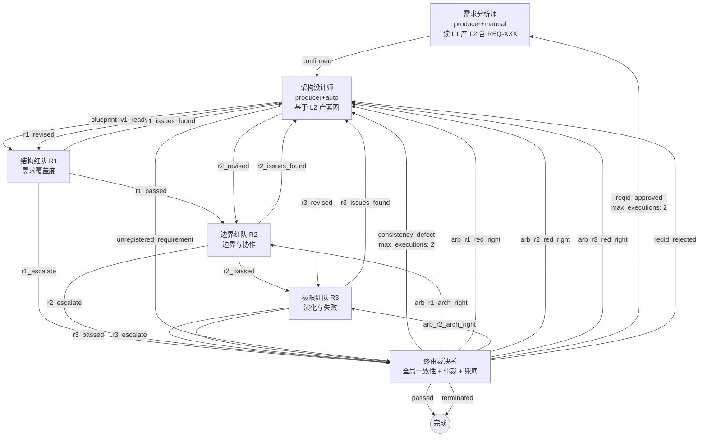

# APP 构建报告

## 一、构建概览

| 项目 | 内容 |
|------|------|
| **目标 APP 名称** | `pure-arch-design`（纯架构设计 APP） |
| **构建时间** | 2026-07-18 |
| **迭代轮次** | 第 2 轮 |
| **当前状态** | `tracked`（C2 SDK 待办已归档；3 项 minor + 1 项运维监控待下一轮闭环） |
| **APP 构建等效通过依据** | 裁决审计者 `arch_challenge_overturned`（C2 根因属 SDK v4.0+ 升级范畴，APP 层已最大努力缓解） |
| **综合裁决者** | `conditional_pass`（4/5 upheld 真闭环，C2 为 SDK 已知限制） |
| **compiler 静态检查** | PASS（0 错误 / 1 警告：架构设计师-validate ROUTE_SKILL_UNDOCUMENTED，producer 自动展开校验角色的已知限制） |
| **模拟验证者** | `validated`（六维 LLM 内容质量全部 PASS + 运行时语义可达性逐角色验证） |

---

## 二、需求摘要

构建一个**职责单一**的纯架构设计 APP：只做架构设计，不做实施 / 测试 / 运维。核心特征是通过 **3 轮强制对抗**（结构红队 / 边界红队 / 极限红队）收敛架构质量，**必须连续 3 轮全部通过**才输出最终架构蓝图，把人工 review 变成可追溯、可对抗、不可绕过的硬门。

需求规格经 v1 → v2 → v3 三轮迭代，闭环历史 finding 共 **20 项**（v1→v2 9 项 + v2→v3 11 项，含 4 项 critical + 8 项 major + 5 项 medium + 8 项 minor，全部闭环）。v3 全量重写以闭环所有 finding，**不保留 v2 痕迹**。

---

## 三、生成的架构总览

### 角色清单（6 角色）

| 角色 | 类型 | confirm | 职责 |
|------|------|---------|------|
| **需求分析师** | producer | manual | 读 L1 原始诉求，产出 L2 需求规格文档（含 REQ-XXX ID 体系），对抗期冻结；兼职 §9.4 REQ-ID 增补的 L2 更新 |
| **架构设计师** | producer | auto | 基于 L2 产 Markdown 架构蓝图（7 个强制章节）；承接红队反馈逐条响应；跨层回退时归档到 outputs/archive/run-{N}/ |
| **结构红队** | standard | auto | R1 阶段 — dimension=`需求覆盖度`：每条 REQ-XXX 是否落位？落位是否满足 high-① 最小形态三要素？ |
| **边界红队** | standard | auto | R2 阶段 — dimension=`边界与协作`：RACI 清晰度？并行兼容性？接口对齐？命名冲突？文档层级闭环？ |
| **极限红队** | standard | auto | R3 阶段 — dimension=`演化与失败`：极端场景？扩展能力？失败模式（单点失效/依赖不可用/过载）覆盖？ |
| **终审裁决者** | standard | auto | 全局一致性校验；轮内/跨轮升级仲裁；死循环兜底终止权；REQ-ID 增补审批 |

> 另有 2 个由 compiler 自动展开的校验 step（需求分析师（校验）/ 架构设计师（校验）），非独立角色。

### 流程拓扑（Mermaid 图）

**核心编排特征**：
- **3 轮正交对抗**（R1 需求覆盖度 → R2 边界与协作 → R3 演化与失败），前一轮不过后一轮不启动
- **轮内迭代回路**（局部回退，不设 max_executions，红队逻辑计数 max_iter=3）
- **全局回退回路**（终审 consistency_defect / reqid_approved 均设 max_executions: 2）
- **死循环兜底**（累计 ≥2 次一致性回退 → terminated 终止）

---

## 四、生成的文件清单

### 编译产物（3 份）

| 路径 | 大小 | 说明 |
|------|------|------|
| `ROUTER.json` | 21258 B / 726 行 | 8 step 路由表（含 producer 自动展开的 2 校验 step） |
| `registry.json` | 14171 B / 628 行 | 8 角色注册表 |
| `manifest.json` | 946 B / 38 行 | 5 份知识文档清单 |

### 角色 skill 文件（6 skill.md + 2 principles.md + 6 schema.json）

| 角色 | skill.md | principles.md | schema.json |
|------|----------|---------------|-------------|
| 需求分析师 | 144 行 | 48 行（9 设计原则 / 14 校验项） | compiler 自动生成 |
| 架构设计师 | 164 行 | 47 行（14 设计原则 / 19 校验项） | compiler 自动生成 |
| 结构红队 | 110 行 | —（standard 无 principles） | compiler 自动生成 |
| 边界红队 | 118 行 | — | compiler 自动生成 |
| 极限红队 | 119 行 | — | compiler 自动生成 |
| 终审裁决者 | 276 行 | — | compiler 自动生成 |

### 知识文档（5 份，覆盖 6 角色）

| 文档名 | 行数 | inject_to |
|--------|------|-----------|
| 对抗维度与检查清单 | 225 | 结构红队 / 边界红队 / 极限红队 |
| 严重度判定准则 | 178 | 结构红队 / 边界红队 / 极限红队 / 架构设计师 / 终审裁决者 |
| 架构蓝图规范 | 288 | 架构设计师 |
| L2需求规格编写指南 | 316 | 需求分析师 |
| 轮内迭代与终审判定 | 512 | 架构设计师 / 终审裁决者 |

---

## 五、验证结果摘要

### 模拟验证者（validated）

| 检查项 | 结果 | 说明 |
|--------|------|------|
| Phase 1 编译器静态分析 | PASS | 0 错误 / 1 警告（架构设计师-validate ROUTE_SKILL_UNDOCUMENTED，producer 自动展开校验角色的已知限制） |
| Phase 2 编译产物完整性 | PASS | 3 产物齐全非空 |
| Phase 3 维度 1 数据流完整性 | PASS | 9 项 input/output 闭合（含 C1 carries 信号链真闭环验证） |
| Phase 3 维度 2 max_executions 合理性 | PASS | 5 项 edge 配额校验 + M1 耗尽路径真定义 |
| Phase 3 维度 3 skill↔routing 语义一致 | PASS | 6 角色逐角色 emit 可达性验证 |
| Phase 3 维度 4 知识文档数据流 | PASS | 5 知识文档存在 + inject_to 匹配 + skill 引用一致 |
| Phase 3 维度 5 producer principles 完整性 | PASS | 2 producer 均 ≥5 设计原则 + ≥5 校验项 |
| Phase 3 维度 6 skill/schema 格式一致 | PASS | 6 角色 verdict enum 与 edges 完全对齐 |
| 5 项 upheld 发现闭环 | 4 CLOSED + 1 MITIGATED | C1/M1/M2/M3 闭环；C2 为 APP 层最大努力缓解（SDK 根因） |
| 第一轮 minor（模板残留） | CLEANED | 10 文件末尾模板残留已全部清理 |

### 三路并行审阅

| 审阅者 | verdict | critical | major | minor |
|--------|---------|----------|-------|-------|
| 结构审阅者 | confirmed | 0 | 0 | 3（F-STRUCT-004/005/006） |
| 合规审阅者 | confirmed | 0 | 0 | 1（MINOR-001 红队 skill 引用未注入文档） |
| 架构红队 | challenged | 1（C2-续） | 0 | 0 |

### 综合裁决者：`conditional_pass`

核心理由：
1. 5 项 upheld 发现中 4 项真闭环（C1/M1/M2/M3 经结构/合规/模拟验证三方独立确认）
2. C2 是 SDK_SPEC §3.4 明确记录的根本限制（fail 边自动生成不设 max_executions，APP 层无法覆盖），v2 已做 APP 层最大努力缓解
3. 4 项 minor findings 均不阻断主链路，AC-1~AC-10 全部可证伪
4. loop 回退架构师无法根本修复 C2（架构师无 SDK 升级权限）

### 裁决审计者：`arch_challenge_overturned`

独立核验架构红队 C2-续 三项技术论点（Gate 自检是软约束 / terminated emit 对 fail 路径无效 / SDK §5.6 不过滤 fail）后，确认**全部准确**，但根因属 SDK §3.4 引擎层硬约束。判定：
- 技术论点准确性 ✓
- 根因归属：SDK 升级范畴（非 app-builder 修复范畴）✓
- 架构师 APP 层最大努力 ✓
- 方案 D（producer + auto + 校验 step）评估：概率性缓解非根本修复 + 增加拓扑复杂度
- **等效通过直达终点**

---

## 六、TRACK 追踪

### 统计

| 维度 | 数量 |
|------|------|
| 本轮新增 TRACK | **10**（原 5 + 闭环审查新增 5） |
| 本轮已闭环 TRACK | **30**（11 需求层 v2→v3 + 9 需求层 v1→v2 + 4 app.yaml upheld + 3 skill/knowledge + **v4.1 C1/C2/C3 修复 3**） |
| 持续 TRACK | 0（上一轮追踪表为占位符） |

### 新增 TRACK 明细

| TRACK-ID | 来源 | category | severity | 标题 | 状态 |
|----------|------|----------|----------|------|------|
| **TRACK-001** | 裁决审计者 | SDK_SPEC_EVOLUTION | **critical** | C2 根因修复：SDK §3.4 fail 边默认 max_executions + 耗尽转 terminated | open（SDK v4.0+ 待办） |
| TRACK-002 | 裁决审计者 + 结构审阅者 | RUNTIME_MONITORING | medium | 运行时监控：终审 fail 边触发 ≥3 次告警 | open |
| TRACK-003 | 合规审阅者 | CONTENT_CONSISTENCY | minor | 3 红队 skill.md 引用未注入的 knowledge 文档《轮内迭代与终审判定》 | open（下一轮修复） |
| TRACK-004 | 结构审阅者 | RUNTIME_MONITORING | minor | M2 archive 策略运行时监控 | open |
| TRACK-005 | 结构审阅者 | RUNTIME_PERMISSION | minor | AC-8 红队 process 目录信息隔离依赖运行时权限 | open |
| **TRACK-006** | 闭环审查 | APP_TOPOLOGY | **critical** | **C1 FORK_NO_JOIN**：R2 扇出 [极限红队, 质量红队] 后无 JOIN，R3 单独完成即误触发终审绕过 R4 | **CLOSED**（v4.1：R3/R4 通过边合并为数组源 JOIN，input_groups 变为 AND 组） |
| **TRACK-007** | 闭环审查 | APP_TOPOLOGY | **critical** | **C2 arb_r3_arch_right 跳过 R4**：R3 escalate 仲裁通过后直接到完成，R4 进攻型对抗被绕过 | **CLOSED**（v4.1：删除 R3/R4 escalate 独立边，max_iter 用尽改为 emit terminated） |
| **TRACK-008** | 闭环审查 | APP_DESIGN_DEFECT | major | 终审裁决者上帝角色（3 类职责 / 13 verdict） | open（下一轮拆分为 3 角色考虑） |
| **TRACK-009** | 闭环审查 | CONTENT_CONSISTENCY | major | 需求规格 v3 与 app.yaml v4 脱节（3 轮 vs 4 轮 / 6 角色 vs 8 角色） | **CLOSED**（v4.1：00-需求描述.md 重写为 v4，3 轮 → 4 轮，新增 R4 进攻型对抗 + R3/R4 JOIN 语义） |
| **TRACK-010** | 闭环审查 | SDK_SPEC_EVOLUTION | major | input_groups step 级 OR 语义缺陷（同一 step 既是 JOIN 源又是 escalate 源时，OR 组优先满足） | open（SDK v4.0+ 考虑 verdict-aware input_groups） |

### 关键 SDK_SPEC 演进提案

**SDK-PROP-001**（来自 TRACK-001）：SDK fail 边语义升级

| 维度 | 现状 | 提议 |
|------|------|------|
| §3.4 fail 边生成 | 自动生成 backward 不设 max_executions | 默认 max_executions: 3（可被 APP 层 max_fail_retries 覆盖） |
| §3.4.1（新增） | 未定义 | fail 边 max_executions 耗尽后自动 advance(verdict=terminated) |
| §5.6 verdict_enum 动态过滤 | 仅作用于 schema enum 内 verdict | 扩展：fail 边 edge_counts 达上限后增加 fail_exhausted: true 标记 |

- 向后兼容：✓（默认 max_executions: 3 是新增约束，不破坏正常流程）
- 验证场景：本 workspace pure-arch-design APP 的 C2 场景
- 状态：proposal_ready_for_sdk_roadmap
- 诉求来源：pure-arch-design-app-builder

---

## 七、下一步建议

### 当前 verdict：`tracked`

选择理由：本轮 10 项 TRACK 已完整收集并归档（含闭环审查新增的 C1/C2 修复 2 项已闭环 + SDK_SPEC 演进提案 2 项），但尚有 TRACK-001~005 + 008~010 其 8 项待后续迭代闭环。按 skill verdict 规则不选 completed（多项 TRACK 未闭环）/ 不选 proposal_ready（还有 APP 层 major 项 TRACK-008/009 待闭环）。

### 推荐的下一步行动

#### A. 立即可执行（不依赖下一轮迭代）
1. **SDK 升级路线图推送**：将 SDK-PROP-001（fail 边默认 max_executions + 耗尽转 terminated）登记到 SDK v4.0+ 升级路线图，关联本 workspace 作为诉求来源
2. **运行时监控告警配置**：根据 TRACK-002 / TRACK-004 建议在运行时引擎层配置监控指标：
   - `terminal_judge_fail_edge_trigger_count ≥ 3` → P1 告警
   - `archive_directory_creation_on_cross_layer_rollback 缺失` → P2 告警
3. **C2 已知限制透明标注**：在最终架构蓝图附录中明确标注 C2 为「SDK 已知限制，APP 层已最大努力缓解，待 SDK v4.0+ 根本修复」（app.yaml L563-568 已声明，可在蓝图附录中呼应）

#### B. 下一轮迭代修复（minor 项）
1. **TRACK-003**：3 红队 skill.md 引用未注入文档 — 推荐方案 b（删除 skill.md 中对《轮内迭代与终审判定》的引用，保持 inject_to 严格匹配）
2. **TRACK-002 / TRACK-004**：在知识文档《轮内迭代与终审判定》新增「运行时监控建议」章节，记录 fail 边触发 + archive 目录生成两类监控信号
3. **TRACK-005**：推送至运行时引擎层 — R1/R2/R3 红队 process 目录独立子目录 + 跨轮权限隔离

#### C. APP 本身使用说明
- pure-arch-design APP **v4.1 修复后拓扑语义已闭环**：R3+R4 真正并行 + JOIN 同步汇入，R3 单独完成不再误触发终审。
- 已知风险：
  - C2-SDK（TRACK-001）：在极端场景（LLM 持续输出格式错误的 JSON）可能死循环，依赖运行时监控告警 + 人工介入。SDK v4.0+ 升级后自动根本修复。
  - R3/R4 僵局终止（TRACK-007 修复的副作用）：R3 或 R4 max_iter=3 用尽时直接 emit `terminated` 走向终束，失去轮内仲裁的机会。这是为保障 JOIN AND 语义主动付出的代价。

### verdict 路由目标

按 skill verdict 规则，`tracked` 路由至 **需求接收者（max: 3）** 进入下一轮全局迭代。下一轮迭代重点：闭环 TRACK-002/003/004（minor + 运维建议补充到知识文档）；TRACK-001/005 推送至 SDK / orchestrator 层，超出 APP 层范畴。

---

**报告生成者**：知识管理者
**报告版本**：v1（首次填写）
**关联追踪表**：`process/outputs/知识演进追踪表.json`
